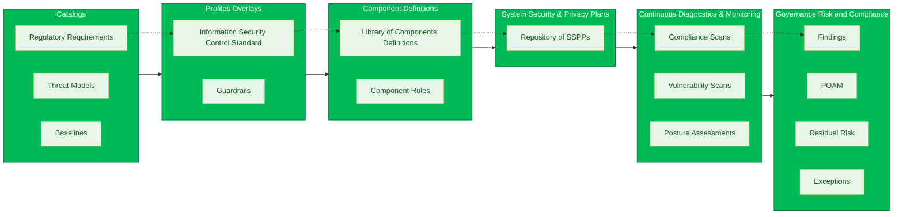

# oscal-content

Initial thoughts on moving to oscal for standards, profiles, guidelines, and baseline management

testing - DO NOT USE .... 

```mermaid
flowchart LR
    %% Direction
    %% Columns represented as subgraphs

    subgraph A[Catalogs]
        A1[Regulatory Requirements]
        A2[Threat Models]
        A3[Baselines]
    end

    subgraph B[Profiles Overlays]
        B1[Information Security Control Standard]
        B2[Guardrails]
    end

    subgraph C[Component Definitions]
        C1[Library of Components Definitions]
        C2[Component Rules]
    end

    subgraph D[System Security & Privacy Plans]
        D1[Repository of SSPPs]
    end

    subgraph E[Continuous Diagnostics & Monitoring]
        E1[Compliance Scans]
        E2[Vulnerability Scans]
        E3[Posture Assessments]
    end

    subgraph F[Governance Risk and Compliance]
        F1[Findings]
        F2[POAM]
        F3[Residual Risk]
        F4[Exceptions]
    end

    %% Top-level column flow
    A --> B --> C --> D --> E --> F

    %% Optional: connect representative children to show hierarchy flow
    A1 -.-> B1
    B1 -.-> C1
    C1 -.-> D1
    D1 -.-> E1
    E1 -.-> F1

    %% Optional styling for readability
    classDef col fill:#0b5,stroke:#064,stroke-width:1px,color:#fff;
    classDef item fill:#e8f5e9,stroke:#9ccc65,stroke-width:1px,color:#1b5e20;

    class A,B,C,D,E,F col;
    class A1,A2,A3,B1,B2,C1,C2,D1,E1,E2,E3,F1,F2,F3,F4 item;
```
