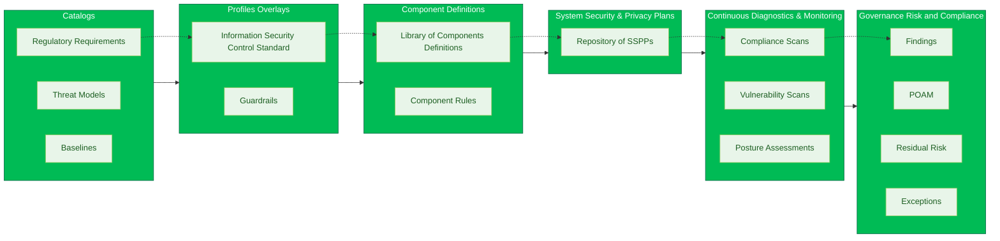
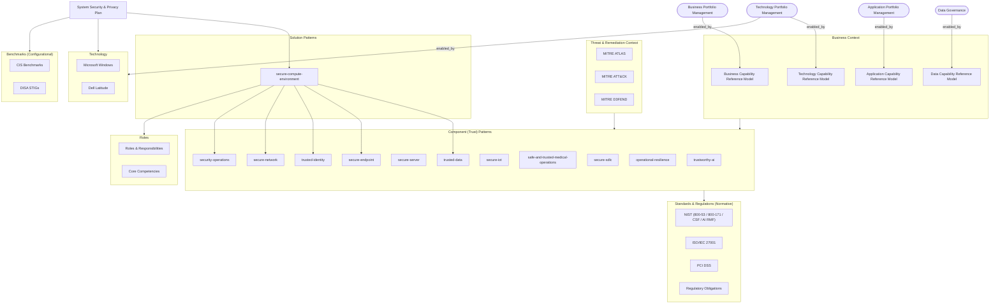

## ⚠️ WARNING — EXPERIMENTAL RESEARCH REPOSITORY

This repository is an **experimental research and exploration space** for modeling security and privacy architectures using OSCAL within an environment of exceptional scale and complexity. The context includes dozens of semi‑autonomous faculties, hundreds of business units, hundreds of independent IT teams, multiple overlapping governance structures, and operational domains spanning nearly every industry—research, education, healthcare, clinical operations, high‑performance computing, enterprise systems, operational technology, IoT, and advanced AI.

**This repository is _not_ authoritative, _not_ endorsed, and _not_ approved for production use.** The models, patterns, and structures contained here are **incomplete, evolving, and subject to change without notice**. They are published solely to explore how capability‑based security patterns, threat‑informed design, and OSCAL data models might scale in a highly federated, multi‑disciplinary institution. Nothing in this repository should be interpreted as institutional policy, required practice, implementation guidance, or compliance direction, and it must **not** be relied upon for system authorization, procurement, or regulatory attestation.

The work intentionally separates standards and regulations, capability patterns, solution architectures, and implementation benchmarks in order to test whether such abstractions can realistically support automation, traceability, and risk reasoning at large scale. Any resemblance to real governance structures, controls, or operating procedures is conceptual only. **Use at your own risk, for research and experimentation purposes only.**

After many attempts to define component-defintions, always ended up with control duplication and issues finding the right control set, and a technology specific set, which is unsustainable at scale.

The bottom up approach is a significant issue.

# Busines-Context Driven - Technology Agnostic Approach to OSCAL Artifact Organizaiton (WIP)

## 1. Purpose of the Architecture
This architecture formalizes a clean separation between intent, assurance, and implementation. It ensures that:
* security requirements remain technology‑agnostic, and
* security evidence is system‑specific and testable.

This separation is essential for scalability across:
* IT, OT, IoT, IoMT, and AI systems,
* multiple regulatory regimes,
* rapidly changing technology platforms.

## 2. Business & Threat Context (Why Controls Exist)
### Business Context
The Business Reference Models (BRM, ARM, DRM, TRM) define:
* what capabilities the institution must deliver,
* what assets matter (applications, data, technology),
* and where accountability lies.

These models establish business intent, not security configuration.
### Threat & Remediation Context
MITRE ATT&CK, ATLAS, and D3FEND define:
* how adversaries operate,
* how AI‑specific attacks differ from traditional ones,
* and how defensive intent should be structured.

Together, these contexts answer:
* Why do we need a security capability at all?

## 3. Component (Trust) Patterns (What Must Be True)
Component Patterns (e.g., trustworthy-ai, secure-endpoint, trusted-data) express assertable trust capabilities.

Key characteristics:
* Technology‑agnostic
* Reusable across systems
* Derived from business needs + threat reality
* Modeled as OSCAL component-definitions

Critically:
* Component Patterns do not prescribe configuration.
* They assert that a capability exists and is governed.

## 4. Component Patterns → Catalogs (Standards & Regulations)
Standards and regulations (NIST, ISO, PCI, HIPAA, GDPR, etc.) are normative:
* They define what outcomes must be achieved
* They do not define how to configure systems

Therefore, the correct relationship is:
* Component Patterns satisfy Standards & Regulations

Examples:
* trusted-identity → NIST AC / IA families
* trustworthy-ai → NIST AI RMF
* secure-network → PCI DSS segmentation requirements

This allows:
* one component pattern to satisfy multiple standards, and
* standards to evolve without rewriting architectures.

## 5. Solution Patterns (How Systems Are Built)
Solution Patterns (e.g., secure-compute-environment) are compositions of component patterns.

They:
* define reference architectures,
* remain reusable,
* but are more concrete than trust assertions.

A solution pattern answers:
* How do we assemble multiple trust capabilities into a workable design?

## 6. SSPP → Benchmarks (How Evidence Is Provided)
The System Security & Privacy Plan (SSPP) is where assurance becomes real.

The SSPP:
* binds solution patterns to actual technologies,
* uses benchmarks (CIS, STIGs, etc.) as evidence,
* documents deviations, compensating controls, and POA&Ms.

Benchmarks are:
* platform‑specific,
* version‑specific,
* testable.

Therefore:
* Benchmarks belong to the SSPP, not the component patterns.

This avoids hard‑coding technology assumptions into architecture.

## How This Repository Fits Together (So far)

This repository intentionally separates **architecture**, **capability assertions**, and **system‑specific assurance** to enable scale, reuse, and automation.

The key artifacts are:

- **Component (Trust) Patterns** (`./patterns/README.md`)  
  Define **technology‑agnostic, normative trust capabilities** (e.g., trusted‑identity, secure‑network, trustworthy‑ai).  
  These patterns assert *what must be true*, not how systems are configured.

- **SSPP Composition Model** (`./SSPP_COMPOSITION_MODEL.md`)  
  Describes how trust patterns, shared services, and inherited capabilities are composed into **System Security & Privacy Plans (SSPPs)**, including:
  - inheritance and reuse,
  - assessment scope,
  - findings, POA&Ms, and residual risk handling.

In summary:
- This document defines **the architectural model and flow**
- Trust Patterns define **reusable trust expectations**
- SSPP composition explains **how system‑specific assurance is constructed and governed**
