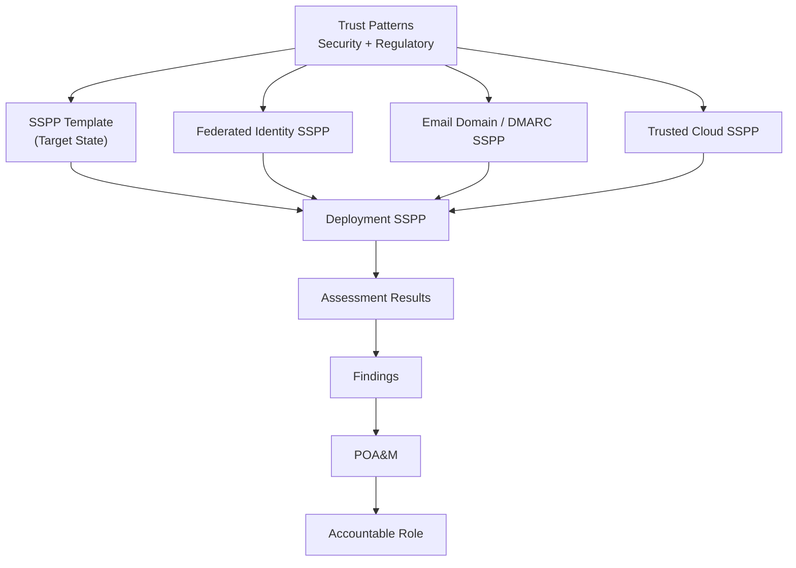

# SSPP Composition, Trust Inheritance, Risk, and Regulatory Communications Model

## Purpose of This Document

This document explains how **System Security and Privacy Plans (SSPPs)** are composed using institutional **trust patterns**, **foundational SSPPs**, and **deployment‑specific SSPPs**, and how **assessment, POA&Ms, risk, and regulatory requirements for communications** fit into that model.

It provides a shared mental model for architects, engineers, assessors, privacy officers, communications teams, and auditors so that:

- trust requirements are defined once and reused,
- SSPPs remain focused and scalable,
- regulatory obligations are enforced through architecture rather than ad‑hoc process,
- risk is identified and managed explicitly,
- and large‑scale consolidation (from unmanaged point solutions to enterprise platforms) can be governed without weakening standards.

This document is **architectural and normative**, not procedural guidance or a compliance checklist.

---

## Core Principle: Trust Is Composed, Not Rewritten

Institutional systems rarely operate in isolation. Most depend on shared services such as:

- enterprise identity providers,
- DNS and email identity infrastructure,
- cloud execution platforms,
- centralized logging and monitoring.

Rather than redefining and re‑assessing these capabilities repeatedly, this model treats them as **foundational trust services** that can be **referenced and inherited**.

An SSPP therefore does **not** attempt to describe everything. It describes:

1. **What capability the system provides**
2. **What trust assertions it relies on**
3. **Which foundational SSPPs satisfy those assertions**
4. **Where the system’s unique responsibilities begin**

---

## Scope and Extensibility of the Model

This model is presented initially through the lens of **security trust**, using security‑focused trust patterns such as `secure‑identity`, `secure‑dns`, and `trusted‑cloud`.

This focus is intentional. Security trust provides a clear and mature foundation for demonstrating how architectural requirements can be composed, inherited, assessed, and remediated at scale.

However, this composition model is **not limited to security requirements**.

The same structure applies equally to other institutional requirement domains that govern system behavior, including:

- privacy and data‑protection obligations,
- accessibility requirements (e.g., AODA),
- records retention and information lifecycle rules,
- communications, branding, and usage policies,
- regulatory obligations that constrain *who may be contacted and under what conditions*,
- institutional technology standards and architectural constraints.

In this model:

- **Trust patterns** define normative requirements within a domain,
- **SSPP templates** assert target‑state expectations,
- **Foundational SSPPs** centralize shared obligations,
- **Deployment SSPPs** describe how a system satisfies those obligations,
- **Assessments and POA&Ms** manage deviations.

Security is the starting domain, not the boundary of applicability.

---

## Layers in the Model

### 1. Trust Patterns (Architecture Layer)

Trust patterns define **what “good” looks like**, independent of any system or product.

Examples include:

- `secure-identity`
- `secure-time`
- `secure-dns`
- `trusted-cloud`
- `email-bulk-messaging-gateway` (primary functional capability)

Patterns are:

- normative and institutionally owned,
- declarative of expected behavior,
- independent of vendor capabilities,
- stable over time.

Patterns are the **source of truth**.

---

### 2. SSPP Template (Target State)

The SSPP template is a **target‑state declaration**.

It answers:

> *What must be true for this class of system to be acceptable for institutional use?*

Characteristics:

- references trust patterns and composites,
- defines logical system components,
- declares expected trust posture,
- assigns accountability roles,
- contains **no product details**,
- contains **no transitional allowances**.

The SSPP template does not describe reality — it defines the benchmark against which reality is assessed.

---

### 3. Foundational SSPPs (Shared Trust Services)

Some trust capabilities are implemented once and reused across many systems.

Examples:

- **Federated Identity SSPP** (Entra ID, MFA, conditional access)
- **Email Domain and DMARC SSPP**
- **Trusted Cloud SSPP**

Foundational SSPPs:

- fully articulate control implementations,
- are assessed independently,
- generate their own findings and POA&Ms,
- provide inherited trust for dependent systems.

They are **referenced**, not duplicated.

---

### 4. Deployment‑Specific SSPP

A deployment SSPP answers:

> *How does this specific system implement the SSPP template?*

It:

- maps products and services to logical components,
- references foundational SSPPs for inherited trust,
- describes actual configuration and behavior,
- states facts without justification or negotiation.

Deployment SSPPs may reflect incomplete enforcement; that is addressed through assessment and POA&Ms, not through modification of requirements.

---

### 5. Assessment Results

Assessments evaluate:

- whether the deployment SSPP meets the SSPP template,
- whether inherited trust is consumed correctly,
- whether controls are missing or incomplete.

Findings represent **observable deviations** — and therefore **risk**.

---

### 6. POA&Ms

POA&Ms exist because findings exist.

They:

- plan remediation or formal risk handling,
- assign accountable roles,
- establish milestones,
- preserve traceability to architectural intent.

POA&Ms do not redefine patterns or SSPP templates.

---

## Relationship to Risk Management

This model distinguishes clearly between **trust requirements** and **risk management**.

### Key Principle

> **Risk is a property of deviation, not of architecture.**

Trust patterns and SSPP templates are normative and risk‑agnostic.  
Risk becomes visible only when a deployed system fails to meet an asserted requirement.

| Layer | Role with Respect to Risk |
|-----|----------------------------|
| Trust Patterns | Define expectations |
| SSPP Template | Assert target posture |
| Deployment SSPP | Describe implementation |
| Assessment Results | Reveal risk |
| POA&Ms | Manage or accept risk |

Risk handling decisions occur after deviation is identified and are governed outside the architectural model.

---

## Regulatory Communications and Consent Constraints  
*(GDPR, CASL, CAN‑SPAM)*

### Purpose of This Section

Some requirements do not govern *how securely* a system operates, but **whether a system is permitted to act at all with respect to specific recipients**.

Regulations such as:

- GDPR (EU),
- CASL (Canada),
- CAN‑SPAM (United States),

constrain **who may receive email**, **under what basis**, and **with what ongoing rights** (e.g., opt‑out).

These requirements shape system behavior and must be enforced **architecturally**, not informally.

---

### Architectural Framing of Consent Requirements

In this model:

- Consent, lawful basis, and opt‑out are treated as **preconditions to system action**
- They constrain **authorization and execution**, not authentication
- They apply to **data subjects and recipients**, not to system operators

Regulatory obligations therefore intersect with:

- `email-bulk-messaging-gateway` (primary capability),
- `identity-authorization` (who may send, on whose behalf),
- future data and privacy patterns (where consent state is governed).

---

### Institutional Expectations (Normative)

For systems providing bulk or campaign email capability:

- Messages SHALL only be sent to recipients for whom a valid legal basis exists
- Consent or lawful basis SHALL be enforced prior to message execution
- Opt‑out and unsubscribe mechanisms SHALL be honored consistently and promptly
- Suppression of recipients SHALL override sender intent
- Sender identity and purpose SHALL be clear and attributable

These expectations apply regardless of vendor capability.

---

### Role of SSPPs

- The **email‑bulk‑messaging SSPP template** asserts that consent enforcement is required
- **Foundational privacy or data SSPPs** may define how consent is modeled institutionally
- **Deployment SSPPs** describe how the system enforces consent (or where it does not)
- **Assessments** identify gaps in enforcement
- **POA&Ms** manage remediation or risk acceptance

Regulatory obligations are enforced **through composition**, not through exception handling.

---

### Regulatory Requirements as Behavioral Constraints

This model treats GDPR, CASL, and CAN‑SPAM not as checklists but as **behavior‑governing constraints**:

- They define when sending is permitted
- They constrain campaign execution
- They shape what the system is allowed to do, not merely how it does it

As additional regulatory domains are formalized, they can be expressed using the same pattern and SSPP composition mechanics without altering the core model.

---

## POA&M Traceability Model

POA&Ms SHALL be traceable across architectural layers.

Each POA&M is linked to:

1. Trust Pattern or Composite  
2. Pattern Component  
3. SSPP Template Requirement  
4. Deployment SSPP Assertion  
5. Assessment Finding  
6. Accountable Role  

POA&Ms remediate deviations; they never redefine expectations.

---

## Application to the Email Campaign Platform

For institutional email campaign capabilities:

- **Primary system capability:** `email-bulk-messaging-gateway`
- **Supporting trust assertions:**
  - `secure-identity`
  - `secure-time`
  - `secure-dns`
  - `trusted-cloud`

The deployment SSPP (e.g., Envoke):

- references the Federated Identity SSPP,
- references the Email Domain / DMARC SSPP,
- references the Trusted Cloud SSPP,
- documents only system‑specific behavior:
  - multitenant subaccounts,
  - RBAC semantics,
  - sender approval workflows,
  - consent enforcement mechanisms,
  - visibility and logging exposure.

Foundational trust is inherited; system‑specific behavior is evaluated.

---

## SSPP Composition, Risk, and Regulatory Enforcement

---

## Key Takeaways
* Trust requirements are defined once and reused through composition
* SSPP templates assert target state, not transitional reality
* Regulatory constraints govern whether actions are permitted
* Risk appears only through deviation, not design
* POA&Ms remediate gaps without weakening expectations
* Security, privacy, accessibility, and communications can evolve coherently within the same model

This document defines the governance spine that connects architecture, compliance, assessment, and risk without collapsing them into a single artifact.