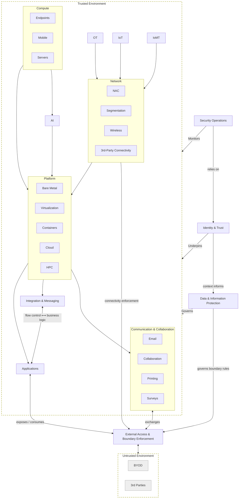

# Trust Planes Overview

This repository defines a **trust‑plane architecture** for describing how institutional trust is established, exercised, monitored, and enforced across systems, data, and interactions.

Trust planes are **not organizational charts, deployment diagrams, or tooling taxonomies**. They are a way of reasoning about **who is trusted to do what, under what conditions, and with what oversight**, independent of specific technologies or implementations.

This trust‑plane model is used as a means of organizing systems, components, and responsibilities in order to **reduce control duplication**, **make trust assumptions explicit**, and **demonstrate control context and rationale**.

Rather than repeating the same controls across every system or technology, trust planes identify *where* a control belongs, *why* it exists, and *what trust concern it addresses*. This allows controls to be inherited deliberately, assessed consistently, and explained defensibly.

At a high level, the model distinguishes between:

- **Trust authorities** — planes that establish, govern, and preserve trust
- **Execution and interaction planes** — where systems operate and decisions are made
- **Trust boundaries** — where trust is explicitly mediated and enforced

---

## Trust Context (High‑Level Model)

**Important:**  
**Trusted Environment** and **Untrusted Environment** are **scopes**, not trust planes.  
They denote **where trust assumptions apply**, not who enforces them.

## Core Trust Authorities

These planes do not execute workloads. They establish, govern, and preserve trust across the environment.

### Identity & Trust
**Purpose:** Establishes who or what may participate in the trusted environment.

Identity underpins every other plane. Authentication, identity assurance, trust anchors, service identity, and non‑human identities all originate here. Identity defines *who may exist* in the trusted environment before any execution or interaction occurs.

➡ Details: `../identity/README.md`

---

### Security Operations
**Purpose:** Monitors, detects, responds, and recovers when trust assumptions fail.

Security Operations observes behavior across all planes, correlates signals using identity context, and initiates response and recovery actions. It does not define policy or execute workloads; it preserves trust over time.

➡ Details: `../security-operations/README.md`

---

### Data & Information Protection
**Purpose:** Governs what may be done with information, wherever it exists.

This plane defines data classification, handling rules, cryptographic requirements, retention obligations, and disclosure constraints. Data does not execute logic; it defines obligations that all other planes must follow, including boundary enforcement.

➡ Details: `../data/README.md`

---

## Execution and Interaction Planes (Within Trusted Environment)

These planes define *where* systems run and *how* interactions occur, subject to the authority and oversight of the core trust planes.

### Compute
Endpoints and servers where code executes.

The Compute plane provides execution capability but does not define policy, trust, or exposure.

➡ Details: `../compute/README.md`

---

### Platform
Shared execution substrates such as bare metal, virtualization, containers, cloud platforms, and high‑performance computing.

The Platform plane enforces isolation, runtime constraints, and platform‑level protections that support applications, integration, and communications.

➡ Details: `../platform/README.md`

---

### Network
Connectivity mechanisms including segmentation, NAC, wireless, and third‑party connectivity.

The Network plane defines *who can connect to whom*. It does not define application behavior or data meaning.

➡ Details: `../network/README.md`

---

### Integration & Messaging
Mediates system‑to‑system communication including routing, transformation, retries, and delivery semantics.

Integration controls **flow**, not **meaning**. Business semantics and authority remain with applications.

➡ Details: `../integration/README.md`

---

### Applications
Where institutional intent, business rules, and decisions are expressed.

Applications consume identity context, data governance rules, integration flows, and platform services to produce outcomes and expose capabilities.

➡ Details: `../applications/README.md`

---

### Communication & Collaboration
Human‑centric interaction systems such as email, collaboration tools, printing, and surveys.

These systems bridge people and technology and introduce distinct trust, social engineering, and data leakage considerations.

➡ Details: `../communication/README.md`

---

### Specialized Domains
These planes represent environments with distinct trust characteristics and risk profiles:

- **OT** – Operational Technology  
- **IoT** – Internet of Things  
- **IoMT** – Internet of Medical Things  
- **AI** – Machine learning, inference, and model lifecycle concerns  

Each domain operates within the trusted environment and is governed by Identity, Data, and Security Operations, while requiring additional domain‑specific controls.

➡ Details: see respective READMEs.

---

## External Access & Boundary Enforcement

**Purpose:** Explicitly mediates trust boundary crossings.

This plane governs ingress and egress, exposure, inspection, filtering, and enforcement between the trusted environment and untrusted entities. It is neither “the network” nor “applications,” but a dedicated boundary‑enforcement authority.

➡ Details: `../external-access/README.md`

---

## Summary

- Trust planes define **responsibility**, not deployment.
- Identity, Security Operations, and Data establish **authority and oversight**.
- Compute, Platform, Network, Integration, Applications, and Communications execute within **trusted scope**.
- External Access is the **only sanctioned mediation point** between trusted and untrusted domains.

This architecture allows trust to be reasoned about **explicitly**, **consistently**, and **defensibly** across systems and over time.