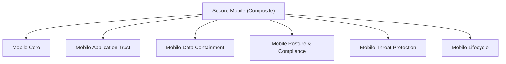

# Secure‑Mobile Architecture

## Purpose

**Secure‑Mobile** defines how mobile devices (phones and tablets) may be used to access institutional services and data **without treating them as execution‑trusted endpoints**.

Secure‑Mobile exists alongside **Secure Endpoint** and **COSU**, not inside them.

> **Secure Endpoint governs execution trust.  
> Secure Mobile governs data exposure within constrained runtimes.**

This distinction is non‑negotiable.

---

## Why Secure‑Mobile Is a Separate Domain

Mobile devices differ fundamentally from endpoints:

- Application‑centric (not OS‑centric)
- Vendor‑controlled operating systems
- Containerized by design
- Limited or no support for privileged execution
- Designed for ambient, portable use

Trying to map mobile devices into **COBO L1/L2/DAW** semantics would collapse the architecture.

---

## Secure‑Mobile Core Principles

1. **Applications are the unit of trust**
2. **Ownership ≠ trust tier**
3. **Containers define security boundaries**
4. **No mobile device may ever be DAW**
5. **Data classification overrides convenience**
6. **Posture provides signals, not authority**

---

## Secure‑Mobile Composite Pattern

### `secure-mobile`

Defines:

- Supported mobile platforms (iOS / Android)
- Acceptable ownership models
- Posture and threat signals
- Application trust requirements
- Data containment and leakage controls
- Mobile lifecycle governance

### Dependencies

- Secure Identity  
- Secure Data  
- Secure Network  
- (Limited) Secure Endpoint signals  

---

## Secure‑Mobile Core Patterns

### 1. Mobile Core
Defines minimum invariants:
- Supported OS versions
- Jailbreak / root detection
- Device encryption state
- Vendor security health
- Enrollment status

---

### 2. Mobile Application Trust
Defines:
- Managed vs unmanaged apps
- App origin and signing
- Approved application catalog
- Version and risk compliance

---

### 3. Mobile Data Containment
Defines:
- Managed application containers
- File system isolation
- Clipboard restrictions
- Offline storage rules
- Inter‑app data sharing policy

> **This is the primary security control for mobile.**

---

### 4. Mobile Posture & Compliance
Evaluates:
- OS integrity and patch level
- Lock screen / biometric state
- App compliance
- Device risk signals

Outputs **signals**, not enforcement.

---

### 5. Mobile Threat Protection
Detects:
- Malicious apps
- Overlay attacks
- Network manipulation
- Risky behaviors

Signal‑driven, non‑punitive by default.

---

### 6. Mobile Lifecycle
Defines:
- Enrollment
- Suspension
- Selective wipe
- Full wipe (as appropriate)
- Decommissioning
- Loaner and visitor handling

---

## Secure‑Mobile SSPP Stack

### Tier‑0: Platform & Reliance

| SSPP | Purpose |
|----|----|
| Secure Mobile Platform SSPP | Authoritative mobile trust definition |
| Secure Mobile Relying System SSPP | How applications consume mobile trust |

---

## Tier‑1: Ownership / Control SSPPs

Mobile classes are **categorical**, not hierarchical.

| Mobile SSPP | Description | Ownership |
|------------|------------|-----------|
| **COBO Mobile SSPP** | Corporate‑Owned, Business‑Operated | Institution |
| **COPE Mobile SSPP** | Corporate‑Owned, Personally‑Enabled | Institution |
| **BYOD Mobile SSPP** | Personally‑Owned, Institution‑Managed | User |
| **Guest / Visitor Mobile SSPP** | Temporary, unmanaged | User |

> **COBO Mobile is not a trust tier.**

---

## What COBO Mobile Means (Explicitly)

### COBO Mobile **does** mean:
- Institution‑owned device
- Mandatory full MDM enrollment
- Strongest feasible container enforcement
- Operating system compliance enforcement
- Administrative wipe authority

### COBO Mobile **does NOT** mean:
- Trusted execution environment
- Endpoint equivalence
- Eligibility for DAW workflows
- Eligibility for Level‑4 data
- Privileged administration

---

## OS‑Specific Mobile SSPPs

Each ownership model has **one SSPP per OS**:

- COBO iOS SSPP  
- COBO Android SSPP  
- COPE iOS SSPP  
- COPE Android SSPP  
- BYOD iOS SSPP  
- BYOD Android SSPP  

Each defines:
- OS version constraints
- Container model
- Enforcement boundaries
- Privacy guarantees
- Wipe semantics

---

## Secure‑Mobile vs Secure Endpoint vs COSU

| Dimension | Secure Endpoint | Secure Mobile | COSU |
|--------|------------------|---------------|------|
| Execution trust | ✅ | ❌ | ✅ (single‑use) |
| Tiered assurance | ✅ | ❌ | ❌ |
| App isolation | Partial | ✅ Primary | Strong |
| Privileged access | ✅ (DAW) | ❌ | ❌ |
| Data containment | Limited | ✅ | ✅ |
| Level‑4 data | ✅ (DAW only) | ❌ | ❌ |

---

## Mobile ↔ Data Eligibility Matrix

| Data Level | Mobile Eligibility |
|-----------|-------------------|
| Level‑0 | ✅ |
| Level‑1 | ✅ |
| Level‑2 | ✅ (managed apps only) |
| Level‑3 | ⚠️ Restricted, read‑only, case‑by‑case |
| **Level‑4** | ❌ **Never** |

> **No mobile device may ever access Level‑4 data.**

This preserves the DAW boundary.

---

## COBO Endpoint vs COBO Mobile (Critical Distinction)

| Aspect | COBO Endpoint | COBO Mobile |
|-----|---------------|-------------|
| Execution model | OS‑centric | App‑centric |
| Trust expression | Tiered (L1/L2/DAW) | Ownership‑based |
| Privileged actions | Allowed | Prohibited |
| Data ceiling | Level‑3 / Level‑4 | Level‑3 (restricted) |
| Administrative use | Yes | No |

Same acronym, **different semantics by design**.

---

## Secure‑Mobile Architecture Diagram

## Architectural Guardrails (Non‑Negotiable)
* Mobile ≠ Endpoint
* No DAW on mobile — ever
* Ownership ≠ execution trust
* Containers override OS assurances
* Data classification always wins
* Encryption alone does not equal trust

## Summary
Secure‑Mobile provides a controlled, auditable, and realistic model for mobile device use:
* COBO Mobile expresses ownership, not trust
* COPE and BYOD respect privacy boundaries
* Applications, not devices, are trusted
* High‑risk data remains protected by DAW
* Endpoint architecture remains intact

Secure‑Mobile complements Secure Endpoint without weakening it.