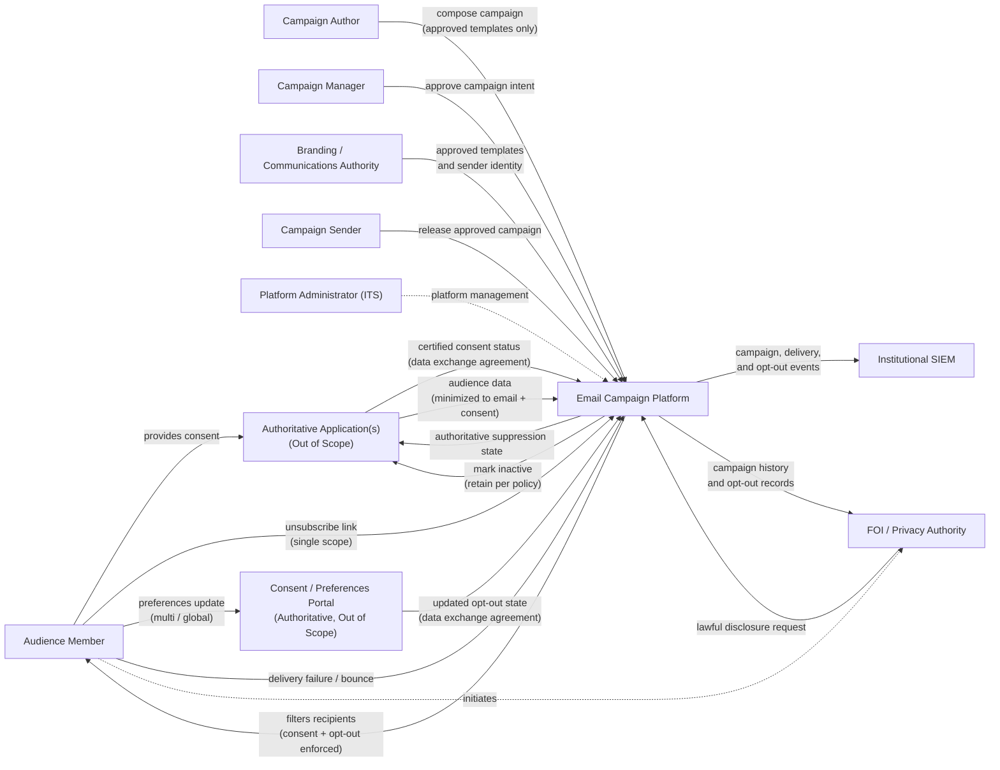
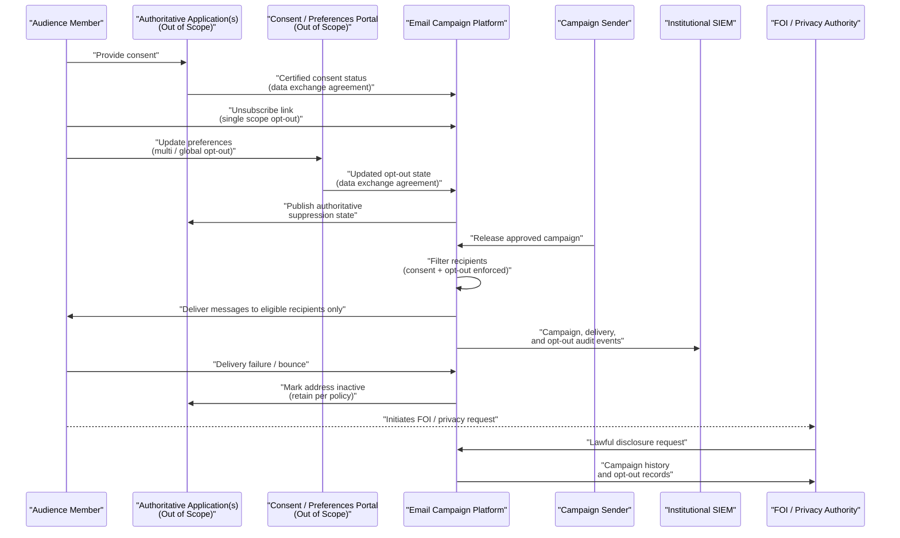

# Email Campaign Platform
**Pattern:** Email Bulk Messaging Gateway  
**Related SSPP:** Email Campaign Platform SSPP Template

---

## Purpose

The **Email Campaign Platform** provides a **governed, auditable, and legally compliant capability** for delivering institutional outbound email campaigns to students, staff, faculty, and public stakeholders.

This pattern focuses on **trust boundaries, regulatory obligations, and enforcement guarantees**, rather than specific products or deployment architectures. It is designed to support **high‑volume email communications** while ensuring:

- lawful consent and opt‑out handling,
- strict data minimization,
- institutional branding and authorization,
- auditability, retention, and disclosure readiness.

---

## Scope

This pattern applies to systems that:

- deliver **bulk outbound email campaigns** on behalf of the institution;
- rely on **authoritative external systems** for consent eligibility;
- must enforce **mandatory opt‑out requirements**;
- are subject to **privacy, accessibility, records, and communications governance**.

This pattern does **not** define:

- UI screens or APIs,
- specific vendors or services,
- message templates or workflows,
- timing or orchestration mechanics.

---

## Architectural Principles

1. **External Consent Authority**  
   The platform does not determine consent legality. It consumes **certified consent status** from authoritative external systems under data exchange agreements.

2. **Authoritative Opt‑Out Enforcement**  
   The platform is the **single enforcement point** for opt‑out and suppression decisions, regardless of where opt‑out is initiated.

3. **Data Minimization by Design**  
   Only minimal recipient attributes (email address and consent/opt‑out status) are retained.

4. **Separation of Duties**  
   Authoring, approval, branding, and sending responsibilities are separated.

5. **Regulatory and Institutional Alignment**  
   The platform enforces obligations derived from regulation and institutional policy.

6. **Auditability and Evidence Preservation**  
   All campaign, delivery, and opt‑out actions are auditable and retained per authoritative schedules.

---

## Canonical Logical Flow Diagram (SSPP‑Derived)

The following diagram illustrates **logical data and responsibility flows** derived directly from SSPP assertions.  
It expresses authority, enforcement, and accountability — **not implementation detail**.

---
## Canonical Sequence Diagram (Illustrative)
The sequence diagram below restates the same guarantees as ordered interactions for explanatory purposes only.
It does not impose timing or implementation constraints.

---
## Opt‑Out Model (Normative)
Opt‑Out Model ( support **user‑selectable opt‑out scopes** and enforce them consistently, without assuming that opt‑out is always global by default. Opt‑out is a **legal and institutional requirement** and MUST be easy, immediate, and non‑overridable.

### Supported Opt‑Out Scopes

#### 1. Single‑Scope Opt‑Out
- Initiated via an **unsubscribe link embedded in every outbound message**
- Does **not require authentication**
- Applies to:
  - the specific campaign, and/or
  - the associated sender identity or communication category
- Takes effect **immediately**

#### 2. Multi‑Scope Opt‑Out
- Managed through an **authoritative consent or preference management interface**
- Allows users to opt out of:
  - selected subscriptions,
  - selected sender identities, or
  - selected communication categories
- Preferences are enforced by the Email Campaign Platform based on certified state received via data exchange agreement

#### 3. Global Opt‑Out
- Requires an **explicit user action**
- Suppresses **all future email campaigns** from the institution across all tenants
- Overrides any campaign‑specific targeting or sender preference
- Shared outward to prevent re‑enrollment

### Enforcement and Authority

- The **Email Campaign Platform is the authoritative enforcement point** for all opt‑out and suppression decisions.
- Opt‑out decisions:
  - MUST be enforced at campaign release and delivery time
  - MUST NOT be overridden by campaign logic, targeting rules, or sender preference
  - MUST NOT expire automatically without explicit user action

### Auditability and Retention

- All opt‑out actions and enforcement decisions MUST be:
  - auditable,
  - retained in accordance with authoritative records and retention requirements,
  - available to support compliance verification, investigations, and lawful disclosure.

### Normative Guarantee

Support for single‑scope, multi‑scope, and global opt‑out is a **non‑negotiable system guarantee**. Failure to enforce opt‑out correctly may result in statutory penalties, regulatory sanctions, reputational harm, and loss of institutional trust.
