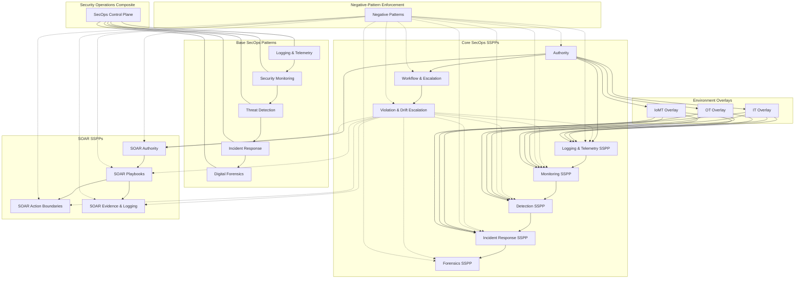

# Security Operations (SecOps) SSPPs

## Purpose

The **Security Operations (SecOps) SSPPs** define how security operations are **authorized, governed, constrained, and executed** across enterprise IT, OT, and IoMT environments.

These SSPPs do **not** define tooling, analytics, or architectures.  
They define **authority, workflow, escalation, automation boundaries, and evidentiary guarantees** that bind the SecOps patterns into an enforceable operating model.

In this framework:

- Patterns define *capability*
- SSPPs define *control*
- Overlays define *environmental constraints*

---

## Design Principles

The SecOps SSPP stack is built on the following non‑negotiable principles:

1. **Authority is explicit and human‑owned**
2. **Observation is not decision**
3. **Decision is not action**
4. **Action is not truth**
5. **Automation accelerates execution, never judgment**
6. **Safety, evidence, and governance outrank speed**

Violating these principles constitutes an **architecture defect**, not a tooling gap.

---

## Scope

### In Scope

- Authorization and governance of:
  - monitoring
  - detection
  - incident response
  - forensics
  - SOAR automation
- Escalation of violations and drift
- Enforcement of forbidden operational and automation patterns
- Environment-specific constraints (IT, OT, IoMT)

### Out of Scope

- Secure SDLC enforcement
- Runtime protection / resilience
- Business continuity and disaster recovery execution
- Application architecture design

Secure‑SDLC SSPPs and Secure‑Resilience SSPPs exist **outside** this SecOps scope and retain independent authority.

---

## SecOps Execution Model

Security Operations follows a **one‑way responsibility chain**:
```
Logging & Telemetry
↓
Security Monitoring
↓
Threat Detection
↓
Incident Response
↓
Digital Forensics
```

No stage may assume the responsibilities of the next.

---

## Security Operations Composite

The **Security Operations Composite** is the control plane that binds all SecOps patterns.

It:
- assigns authority
- governs workflow and escalation
- constrains automation
- preserves evidence integrity

It does **not** produce signals, make detections, respond to incidents, or perform analysis.

---

## SSPP Inventory (Authoritative Order)

### Core SecOps SSPPs

1. **Security Operations Authority SSPP**  
   Defines who may decide, approve, automate, and accept risk.

2. **Workflow & Escalation SSPP**  
   Defines how observations, detections, incidents, investigations, and violations progress.

3. **Violation & Drift Escalation SSPP**  
   Ensures systemic flaws escalate to governance and are never normalized.

4. **Logging & Telemetry SSPP**  
   Defines mandatory observability requirements and treats missing telemetry as control failure.

5. **Security Monitoring SSPP**  
   Defines continuous observation and correlation without declaring maliciousness.

6. **Threat Detection SSPP**  
   Defines analytic expectations, confidence thresholds, and escalation criteria.

7. **Incident Response SSPP**  
   Defines allowable actions, severity handling, containment, recovery, and escalation rules.

8. **Digital Forensics SSPP**  
   Defines evidentiary preservation, chain of custody, and truth establishment.

---

### SOAR SSPPs (Automation Governance)

9. **SOAR Authority SSPP**  
   Defines who may enable, suspend, or revoke automation.

10. **SOAR Playbook SSPP**  
    Defines the approved catalog of automated playbooks and their preconditions.

11. **SOAR Action Boundary SSPP**  
    Defines actions and systems automation must never affect.

12. **SOAR Evidence & Logging SSPP**  
    Ensures automation itself is observable, auditable, and forensically defensible.

---

### Constitutional Constraint

13. **Negative‑Pattern Enforcement SSPP**  
    Defines forbidden operational and automation patterns that are invalid by existence.

---

### Environment Overlays

14. **IT SecOps Overlay SSPP**  
    Baseline specialization for enterprise IT environments.

15. **OT SecOps Overlay SSPP**  
    Safety‑first specialization for Operational Technology.

16. **IoMT SecOps Overlay SSPP**  
    Patient‑safety‑first specialization for clinical and medical environments.

Overlays only **tighten constraints**.  
They never add authority or bypass negative patterns.

---

## SOAR Philosophy

SOAR is treated as **execution acceleration**, not **decision authority**.

Automation may:
- enrich
- notify
- execute pre‑approved, bounded, reversible actions

Automation may never:
- decide maliciousness
- declare incidents
- accept risk
- manipulate forensic evidence
- bypass escalation

Every automated action must be:
- attributable
- logged
- reviewable
- revocable

---

## Architectural Invariants (Enforced by SSPPs)

- Monitoring never acts
- Detection never contains
- Response never determines truth
- Forensics never optimizes for speed
- Automation never outranks humans
- Negative patterns are never acceptable

---

## How Everything Fits Together



## Summary
The SecOps SSPPs create an authoritative, automation‑safe, evidence‑preserving security operations model.
They ensure that:
* decisions are owned
* automation is bounded
* safety and patients are protected
* evidence is never sacrificed
* governance always sees systemic failure

Once these SSPPs are in place, Security Operations becomes executable, auditable, and defensible by design.