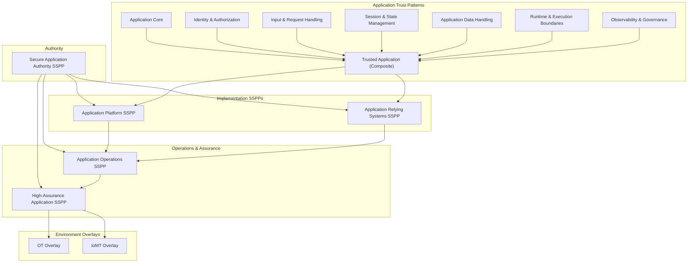

# Secure Application SSPP README

## Purpose

This README defines the **Secure Application System Security & Privacy Plan (SSPP)** model and explains how **application trust patterns** and **application SSPPs** fit together as a coherent trust plane.

The Secure Application SSPP set exists to govern **where application intent becomes action** — the point where:
- authorization decisions are enforced,
- business logic executes,
- data meaning is interpreted,
- state is mutated,
- and side effects occur.

Applications are neither infrastructure nor data stores. They are **decision‑making systems**. Consequently, application trust must be expressed explicitly, governed intentionally, and enforced without collapsing into platform, storage, or regulatory concerns.

---

## Design Principles

Secure Application SSPPs are designed around the following principles:

- **Explicit authority**  
  Application behavior must be governed by explicitly defined, human‑owned authority.

- **Decision-centric trust**  
  Application trust focuses on decision correctness, not only execution safety.

- **Separation of concerns**  
  Applications consume platform and storage trust guarantees; they do not redefine them.

- **No implicit trust**  
  Execution context, environment, or upstream authentication never imply authority.

- **Governable over time**  
  Application behavior must remain observable, explainable, and reviewable.

---

## Application Trust Layers

Secure Application governance is expressed across **four SSPP layers**, supported by **application trust patterns**.

### 1. Application Trust Patterns

Patterns define **what must be true** for an application to be considered trustworthy.

These patterns describe **capability‑level trust properties**, not implementations.

```
application-core
application-identity-and-authorization
application-input-and-request-handling
application-session-and-state-management
application-data-handling
application-runtime-and-execution-boundaries
application-observability-and-governance
trusted-application (composite)
```

Patterns are normative but non‑operational.

---

### 2. Authority SSPP

Establishes **who is allowed to decide** how applications behave.

- Secure Application Authority SSPP

This SSPP defines:
- ownership of application intent,
- authority over authorization semantics,
- approval and exception boundaries,
- escalation requirements.

No other SSPP may override it.

---

### 3. Implementation SSPPs

Define **how trust patterns are implemented and consumed**.

- Secure Application Platform SSPP  
  Governs how execution platforms preserve application trust assumptions.

- Secure Application Relying Systems SSPP  
  Governs how callers, clients, and integrations interact with applications.

Implementation SSPPs **enforce**, but do not decide.

---

### 4. Operations & Assurance SSPPs

Ensure trust remains valid **over time**.

- Secure Application Operations SSPP  
- Secure Application High‑Assurance SSPP (overlay)

Operations coordinate observability and escalation without making trust decisions.  
High‑Assurance tightens tolerances but never weakens guarantees.

---

## Environment Overlays

Application environment overlays are **optional** and used **only when the operating context materially changes risk**.

- Secure Application OT Overlay SSPP  
- Secure Application IoMT Overlay SSPP  

Unlike Storage, most applications do **not** require IT overlays. OT and IoMT overlays exist solely for cases where application behavior affects physical safety or patient outcomes.

---

## Secure Application Architecture Overview

The following diagram shows how **application patterns and SSPPs** fit together by layer.



## Architectural Invariants
All Secure Application SSPPs enforce the following invariants:
* Application authority is explicit and human‑owned
* Execution context never implies trust
* Authorization decisions are unambiguous
* Input intent is validated before enforcement
* State does not extend privilege incorrectly
* Behavior is observable and explainable
* Drift escalates rather than self‑corrects

## Relationship to Other Trust Planes
Depends on
* Platform & Cloud Trust
* Secure Storage Trust
* Identity Trust

Consumes
* Integration Trust
* Communication Trust

Feeds
* Data Trust Plane (future)
* AI Trust Plane (future)
* Regulatory and compliance overlays


## Summary
Secure Application SSPPs provide:
* explicit governance of application behavior,
* separation between authority and enforcement,
* bounded and explainable execution,
* clean escalation paths,
*and defensible assurance over time.

Applications are where institutional intent becomes action.
This SSPP model ensures that intent remains trusted, governed, and accountable.