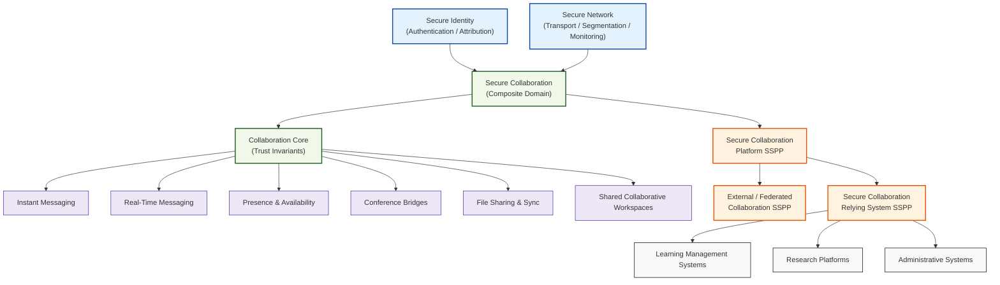

# Secure Collaboration Architecture — README

## Purpose

**Secure Collaboration** defines how institutional collaboration services are designed, governed, and consumed so that **interaction does not become implicit trust**.

This architecture establishes collaboration as a **first‑class security domain**, on par with Secure Identity, Secure Network, and Secure Email, recognizing that modern collaboration platforms combine:
- identity representation,
- persistent shared state,
- real‑time communication,
- external participation,
- and long‑lived content.

Left unmanaged, collaboration platforms routinely become **shadow trust zones**. Secure Collaboration exists to prevent that outcome.

---

## Scope

The Secure Collaboration architecture governs **how collaboration services behave**, not how individual products are configured.

It applies to:
- messaging (instant and real‑time),
- conferencing and meetings,
- presence and availability signaling,
- file sharing and synchronization,
- persistent shared collaborative workspaces,
- external and federated collaboration.

It does **not** replace:
- Secure Identity (authentication and assurance),
- Secure Network (transport, segmentation, monitoring),
- application‑level data governance.

---

## Core Design Principles

### 1. Collaboration ≠ Trust
Participation in a collaboration session, workspace, or channel **does not imply authorization** beyond explicitly granted scope.

### 2. Identity Is Consumed, Not Defined
Collaboration platforms consume identity, assurance, and delegation from **Secure Identity**; they do not create or interpret identity meaning independently.

### 3. Boundaries Are Explicit
Membership, visibility, and persistence are always:
- scoped,
- reviewable,
- time‑bounded where applicable.

### 4. Persistence Increases Risk
The longer a collaboration artifact or workspace exists, the higher the residual risk. Lifecycle awareness is mandatory.

### 5. External Collaboration Is Non‑Transitive
Trust extended to external collaborators:
- is explicit,
- non‑transitive,
- and never equivalent to internal trust.

---

## Secure Collaboration Pattern Structure

Secure Collaboration is decomposed into **foundational trust**, **modality patterns**, and **composite governance**.

### Composite Pattern
- **`secure-collaboration`**  
  Governance anchor defining why collaboration is treated as a security domain and how its modalities relate.

### Foundational Trust Pattern
- **`collaboration-core`**  
  Baseline trust invariants that apply to *all* collaboration:
  - identity context awareness
  - membership control
  - accountability and observability
  - lifecycle governance

### Collaboration Modalities
- **`instant-messaging`** – asynchronous text communication
- **`real-time-messaging`** – low‑latency synchronous messaging
- **`presence-and-availability`** – signaling and status visibility
- **`conference-bridges`** – voice and video conferencing
- **`file-sharing-and-sync`** – shared content and synchronization
- **`shared-collaborative-workspaces`** – persistent collaboration containers

Each modality models:
- its specific threat surface,
- how abuse manifests,
- and the required security properties.

---

## SSPP Stack (Collaboration)

Secure Collaboration assurance is described using a layered SSPP stack:

1. **Secure Collaboration Platform SSPP**  
   Tier‑1 governance and assurance anchor for institutional collaboration services.

2. **External / Federated Collaboration SSPP**  
   Additional constraints for collaboration involving non‑institutional identities.

3. **Secure Collaboration Relying System SSPP**  
   Template for systems that *consume* collaboration services (LMS, research platforms, admin systems).

This mirrors the structure used for Secure Network and Secure Email, enabling clean inheritance and auditability.

---

## Integration with Applications

Applications do **not** implement collaboration security themselves.  
They rely on Secure Collaboration and add **context‑specific constraints**.

Three major application classes are explicitly mapped:

- Learning Management Systems (LMS)
- Research Platforms
- Administrative Systems

The canonical integration guidance is documented in:

➡ **[`MAPPING.md`](./MAPPING.md)** — *Secure Collaboration Application Integration*  
This file explains:
- how each application class uses collaboration modalities,
- what constraints must be added at the application SSPP level,
- and what responsibilities remain with the application.

---

## Standards Alignment

Secure Collaboration aligns with NIST guidance at the **architectural level**:

- **NIST SP 800‑58** — Secure voice and multimedia communication  
- **NIST SP 800‑46** — Remote access, telework, BYOD collaboration  
- **NIST SP 800‑47** — Interconnecting systems and external trust boundaries  

ATT&CK and D3FEND references are used to:
- justify the existence of Secure Collaboration as a domain,
- model systemic risks common to all collaboration modalities,
- avoid implicit or emergent trust.

---

## What Secure Collaboration Is *Not*

To preserve clarity and separation of concerns, Secure Collaboration is **not**:
- an identity system,
- a network enforcement system,
- a data classification authority,
- a system‑of‑record.

Those responsibilities remain explicitly owned by other domains.

---

## Architectural Invariant

> **Secure Collaboration provides interaction trust.  
> Applications provide context and data governance.  
> Neither replaces the other.**

This invariant is the single most important rule enforced by the architecture.

---

## Status

✅ Secure Collaboration patterns complete  
✅ Threat modeling complete  
✅ SSPP stack complete  
✅ Application integration mapped  

Secure Collaboration is now **architecturally mature, auditable, and ready for institutional adoption**.

---
