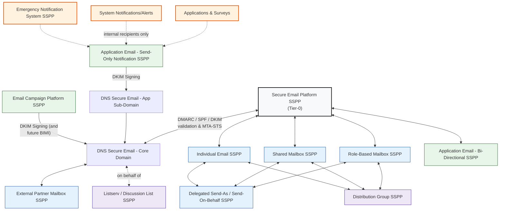

# Secure Email SSPP Templates — Overview & Use Cases

This document provides a **consolidated overview of all Secure Email SSPP templates**, the **problem each one solves**, and **when it should be used**. Together, these SSPPs form a **complete, auditable Secure Email governance model** aligned with Secure Identity and Secure Network.

The key design goal is simple:

> **Email is never “one thing.”**  
> Different email use cases have different trust, scale, authority, and risk properties, and each must be governed explicitly.

---

## Design Principles

All Secure Email SSPPs follow the same core principles:

- **Separation of intent**  
  (person‑to‑person ≠ application ≠ campaign ≠ emergency)
- **Explicit authority models**  
  (no shared credentials, no implicit delegation)
- **Identity‑anchored accountability**
- **Least privilege and scope limitation**
- **Clear escalation paths** (e.g., Distribution → Campaign → Emergency)
- **Selective cyber‑resiliency** (SP 800‑184 only where required)

---

## 1. Secure Email Platform SSPP (Tier‑0)

### Purpose
Defines the **core institutional email platform** as a Tier‑0 enabling service.

### Governs
- Core transport and delivery services
- Sender attribution and identity binding
- Domain reputation and anti‑abuse controls
- Service availability and recovery

### Used When
✅ Always  
This SSPP underpins *every* other email SSPP.

### Not Used For
- Individual policy decisions
- Campaigns
- Emergency messaging logic

---

## 2. Individual Email SSPP

### Purpose
Governs **person‑to‑person human email**.

### Governs
- Individual mailboxes
- Human sending and replying
- Privacy, acceptable use, lifecycle

### Used When
- Staff, faculty, students sending email as themselves
- Routine interpersonal communication

### Explicitly Not For
❌ Bulk messaging  
❌ Notifications  
❌ Automation  
❌ Shared responsibility inboxes  

---

## 3. Delegated Send‑As / Send‑On‑Behalf SSPP

### Purpose
Defines **explicit authority delegation** without shared credentials.

### Governs
- Who may act *as* another mailbox
- Attribution of both actor and represented identity
- Time‑bounded, reviewable delegation

### Used When
- Assistants sending on behalf of leaders
- Teams acting under an official role
- Controlled coverage scenarios

### Key Rule
> **Delegation is the only way to act for another identity.**

---

## 4. Shared Mailbox SSPP

### Purpose
Governs **functional mailboxes** accessed by multiple humans.

### Governs
- No direct login
- Delegation‑only access
- Operational inboxes

### Used When
- `helpdesk@`
- `finance@`
- `inquiries@`

### Not Used For
❌ Applications  
❌ Automation  
❌ Campaigns  

---

## 5. Role‑Based Mailbox SSPP

### Purpose
Governs **mailboxes tied to institutional roles, not individuals**.

### Governs
- Authority continuity across personnel changes
- Role‑based accountability
- Delegated access only

### Used When
- `registrar@`
- `director@`
- `compliance@`

---

## 6. External Partner Mailbox SSPP

### Purpose
Controls **email interaction with external partners** under defined trust boundaries.

### Governs
- Delegated internal access to partner communications
- Explicit external scope
- Contract‑bound use

### Used When
- Vendors
- Service providers
- Inter‑institutional coordination

---

## 7. Distribution Group SSPP

### Purpose
Enables **internal broadcast email**.

### Governs
- One‑to‑many internal messaging
- Posting permissions
- Membership governance

### Used When
- Internal announcements
- Department notices

### Hard Limits
❌ No external recipients  
❌ No campaigns  
❌ No automation  

---

## 8. Listserv / Email Collaboration SSPP

### Purpose
Supports **many‑to‑many email collaboration**.

### Governs
- Discussion lists
- Opt‑in membership
- Moderation
- Archives

### Used When
- Committees
- Communities of practice
- Project discussions

### Mandatory Controls
- Invitation‑based membership
- Timely opt‑out
- Periodic attestation

---

## 9. Email Application Notification SSPP (Send‑Only)

### Purpose
Governs **automated, outbound notifications**.

### Governs
- Send‑only behavior
- No replies
- Dedicated subdomains
- Internal recipients only

### Used When
- System alerts
- Status notifications
- Workflow updates

### Not Used For
❌ Campaigns  
❌ User conversations  

---

## 10. Email Application Bi‑Directional SSPP

### Purpose
Governs **machine‑managed inboxes** with inbound and outbound flow.

### Governs
- Secure parsing of inbound email
- Automated processing
- No human login
- Defensive handling

### Used When
- Ticket intake
- Automated email workflows

---

## 11. Email Campaign Platform SSPP

### Purpose
Controls **high‑volume, purpose‑driven messaging**.

### Governs
- External recipients
- Scale controls
- Opt‑out mechanisms
- Reputation protection

### Used When
- Marketing
- Recruitment
- Engagement campaigns

### Resiliency
- May reference SP 800‑184 for abuse containment and rapid shutdown

---

## 12. Emergency Notification System SSPP

### Purpose
Provides **life‑safety and critical operations alerting**.

### Governs
- Email, SMS, and voice channels
- Highest delivery priority
- Institution‑wide authority

### Used When
- Safety incidents
- Security emergencies
- Critical infrastructure outages

### Special Rules
- No opt‑out
- Dedicated domains
- Strict authority controls
- Mandatory SP 800‑184 alignment

---

## How the Email SSPPs Fit Together

---

## Common Misuse Patterns (Prevented by This Model)

| Misuse | Prevented By |
|------|--------------|
| Using shared credentials | Delegated Send‑As SSPP |
| Using individual mailboxes for bulk | Campaign SSPP |
| Using lists for marketing | Distribution/Listserv SSPPs |
| Treating notifications as conversations | App Notification SSPP |
| Emergency systems used for routine messaging | Emergency SSPP |

---

## Summary

- Secure Email is **not one service**; it is a **family of governed capabilities**
- Each SSPP enforces **intent clarity and risk boundaries**
- Authority, scale, and trust are **explicitly modeled**
- Email cannot quietly become:
  - a broadcast system
  - a campaign engine
  - an emergency channel
  - an automation bus

This SSPP set gives you a **complete, defensible, and future‑proof Secure Email architecture** that integrates cleanly with Secure Identity and Secure Network.