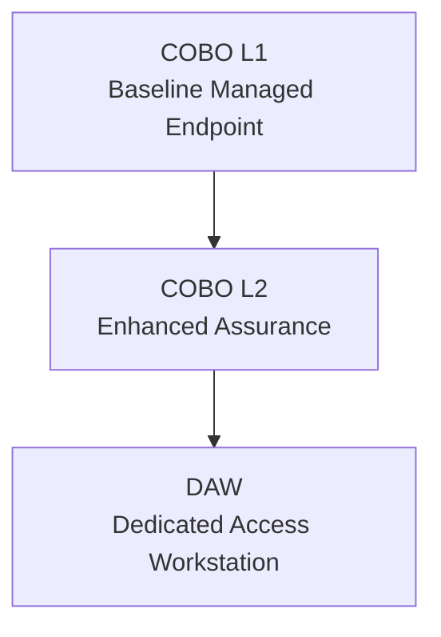

# Secure Endpoint Architecture

## Overview

**Secure Endpoint** defines *which devices the institution is prepared to trust as execution environments* and *under what constraints*.  
It is a foundational security architecture that ensures endpoints are:

- explicitly classified,
- purpose‑bound,
- continuously governed,
- and correctly aligned with **Secure Data**, **Secure Identity**, and **Secure Network**.

Secure Endpoint does **not** define:
- application logic,
- data classification itself,
- or business authorization rules.

Instead, it defines **endpoint trust semantics** that other domains depend on.

---

## Core Design Principles

1. **Endpoints are conditionally trusted execution environments**
2. **Device capability ≠ Data entitlement**
3. **Lock‑down does not equal high trust**
4. **Purpose matters more than platform**
5. **Higher data sensitivity requires stronger execution control**

---

## Secure Endpoint Classes

Secure Endpoint defines **three orthogonal endpoint classes**:

| Endpoint Class | Primary Purpose | Trust Model |
|---------------|-----------------|------------|
| **COBO** (Corporate‑Owned, Business‑Operated) | General user workstations | Tiered (L1 → L2 → DAW) |
| **DAW** (Dedicated Access Workstation) | Privileged & highly sensitive access | Maximal assurance |
| **COSU** (Corporate‑Owned, Single‑Use) | Purpose‑bound shared endpoints | Function‑restricted, low entitlement |

These classes **must never be collapsed into one another**.

---

## COBO Endpoint Model (User Workstations)

COBO endpoints represent **general‑purpose user workstations** that are:
- individually authenticated,
- fully managed,
- lifecycle governed,
- eligible for tiered capability increases.

### COBO Trust Tiers

| Tier | Description | Typical Use |
|----|----|----|
| **COBO L1** | Baseline managed endpoint | General institutional work |
| **COBO L2** | Enhanced assurance endpoint | Sensitive work, admin tooling |
| **DAW** | Dedicated, access‑only endpoint | Level‑4 data, security & infra admin |

### COBO → DAW Relationship

Important invariant:
* DAW is not “COBO L3”.
* It is a qualitatively different execution model.

## COSU Endpoint Model (Single‑Use Devices)

**COSU (Corporate‑Owned, Single‑Use)** endpoints are devices trusted only to perform a *specific, bounded function*.  
They are **not personal workstations**, **not tiered trust endpoints**, and **never elevated to COBO or DAW semantics**—regardless of how locked‑down or hardened they are.

COSU exists to safely support **shared, purpose‑bound, environment‑specific devices** commonly found across teaching, research, administration, facilities, and safety operations.

---

### Core COSU Characteristics

All COSU endpoints share the following invariants:

- **Institution‑owned**
- **Device‑bound identity** (not user‑entitlement driven)
- **Shared or transient user sessions**
- **Single‑purpose execution**
- **Limited and explicit data eligibility**
- **No trust escalation**
- **Rapid reset and recovery**

> **Locked‑down does not equal high trust.**  
> COSU security is about *constraining capability*, not *elevating privilege*.

---

### COSU vs COBO vs DAW

| Dimension | COBO | DAW | COSU |
|--------|------|-----|------|
| Primary role | User workstation | Privileged access | Purpose‑bound device |
| User ownership | Individual | Individual | Shared |
| Execution scope | Broad | Extremely narrow | Single‑function |
| Trust tiering | Yes | N/A | No |
| Data eligibility | Tier‑based | Highest only | Explicit & narrow |
| Admin capability | Yes | Yes (privileged) | No |

---

### COSU Data Eligibility Philosophy

COSU endpoints may be **highly hardened**, but they are **never broadly trusted**.

| Principle | Enforcement |
|--------|-------------|
| Device ≠ data | Endpoint class never implies data entitlement |
| Purpose over strength | Function defines capability |
| Explicit eligibility | Data access is narrowly defined |
| No implicit promotion | COSU never becomes COBO or DAW |

---

### COSU Endpoint Categories

COSU endpoints are defined by **function**, not risk tier.

#### Public / Visitor‑Facing COSU

| Endpoint Type | Purpose | Data Eligibility |
|--------------|--------|------------------|
| Internet Kiosk | Controlled browsing | Level‑0 / Level‑1 |
| Wayfinding / Directory Kiosk | Maps, navigation | Level‑0 |
| Digital Signage | Display‑only messaging | Level‑0 |
| Library Catalog Terminal | Discovery & lookup | Level‑0 / Level‑1 |

---

#### Academic COSU

| Endpoint Type | Purpose | Data Eligibility |
|--------------|--------|------------------|
| Exam Terminal | High‑stakes exams | Level‑1 / Level‑2 |
| Student Assessment (Non‑Exam) | Low‑stakes assessment | Level‑1 |
| Classroom Presentation Terminal | Podium / AV display | Level‑0 / Level‑1 |
| Lecture Capture Console | Recording control | Level‑0 / Level‑1 |

---

#### Research & Operations COSU

| Endpoint Type | Purpose | Data Eligibility |
|--------------|--------|------------------|
| Research Intake Terminal | Consent & intake | Level‑1 / Level‑2 |
| Lab Instrument Terminal | Instrument control | Level‑1 / Level‑2 |
| Print / Scan Release Station | Secure document release | Level‑1 / Level‑2 |
| Front‑Desk / Service Counter | Service workflows | Level‑1 / Level‑2 |

---

#### Facilities, Safety & Security COSU

| Endpoint Type | Purpose | Data Eligibility |
|--------------|--------|------------------|
| Facilities Control Terminal | Building systems | Level‑0 / Level‑1 |
| Clean‑Room / Facility Access Terminal | Physical entry enforcement | Level‑1 |
| Security Viewing Console (Non‑Admin) | Situational awareness | Level‑1 / Level‑2 |
| Emergency / Safety Console | Crisis coordination | Level‑1 / Level‑2 |
| Clinical / Medical Exam Room Terminal | In‑room clinical workflows | Level‑2 / Level‑3 |

---

### COSU Architectural Guardrails

The following rules are **non‑negotiable**:

- COSU endpoints **never become COBO**
- COSU endpoints **never qualify as DAW**
- Sensitive data **does not redefine endpoint class**
- Administrative and forensic actions **require DAW**
- Function defines trust, not hardening strength

---

### COSU Operational Lifecycle

COSU endpoints are designed for **simplicity, stability, and speed of recovery**:

- Deterministic configuration
- Immutable or kiosk‑style OS builds
- Automatic session clearing
- Frequent reimage / reset capability
- Short mean‑time‑to‑restore

> COSU devices are expected to fail safely and recover quickly.

---

### Summary

The COSU Endpoint Model ensures that:

- shared devices remain safe without over‑privileging,
- public‑facing and operational endpoints are constrained by design,
- sensitive workflows are protected without misusing workstation semantics,
- and endpoint trust remains **intentional, explicit, and auditable**.

COSU is a **control boundary**, not a compromise.

---