# Mapping Campus Network Topologies to Secure Network SSPPs
**Mapping Campus Network Topologies to Secure Network enforced**

- Core / Distribution / Access ≠ trust tiers  
- Switches / routers ≠ gateways  
- **Policy enforcement roles define SSPPs**

---

## High‑Level Mapping Table

| Campus Layer | Primary Secure Network Patterns | SSPPs Applied |
|-------------|----------------------------------|---------------|
| **Core** | `network-core` | Secure Network Platform SSPP |
| **Distribution** | `network-segmentation-and-zones` `network-mediation-and-policy-enforcement` *(only if enforcing)* | Secure Network Gateway SSPP *(when policy enforced)* |
| **Access** | `network-access-control` `network-wireless-access` `network-remote-access` | Secure Network Gateway SSPP Guest & Unmanaged Access SSPP *(if BYOD/guest)* |
| **Extensions (VPN/VLAN/Overlay)** | `network-logical-extension` | Logical Extension SSPP |
| **Monitoring (all layers)** | `network-monitoring-and-response` | Platform / Gateway inheritance |
| **Resiliency (all critical paths)** | `network-resiliency` | Platform & Resiliency SSPP |

---

## Mermaid Diagram 1 — Conceptual Layering

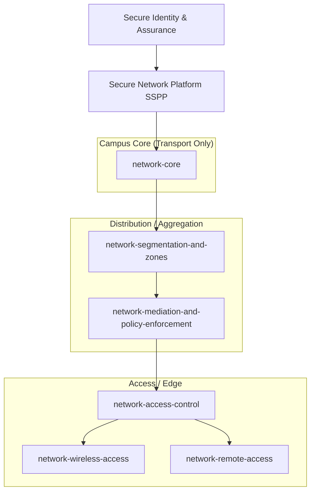
*(with Mermaid diagrams)*

This document shows how **traditional campus topology layers** (Core / Distribution / Access) map to the **Secure Network patterns and SSPPs** in your model. The key idea is that **topology describes traffic flow**, while **SSPPs describe trust and enforcement roles**.

---

## Core Rule

> **Topology layers describe *where packets move**.  

Key takeaway:
* The core never enforces trust. Enforcement starts only where policy mediation exists.

---

## Core Layer
### What the Core Is
* High‑capacity routing and switching
* Redundancy and fast convergence
* Packet movement at scale

### Secure Network Role
#### Pattern:
* `network-core`

#### SSPP:
* **Secure Network Platform SSPP**

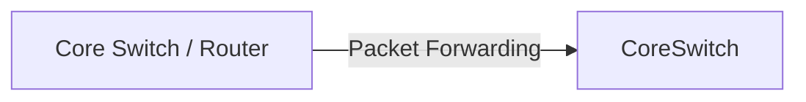
Even if ACLs exist, the core is not a gateway unless it performs policy enforcement.

## Distribution Layer (Two Possible Roles)
### Case 1 — Distribution as Aggregation Only

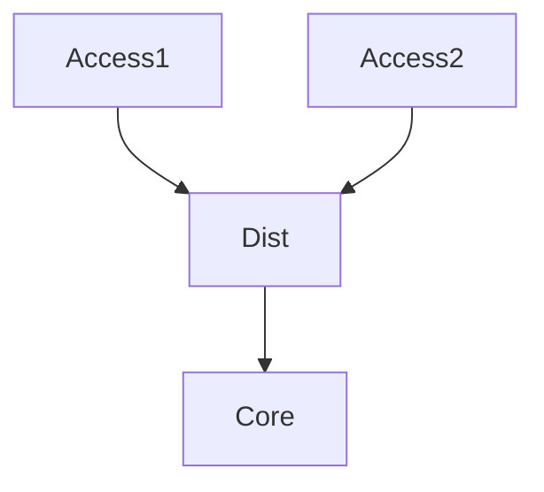
* No identity context
* No policy enforcement

#### Patterns:
* `network-core`
* `network-segmentation-and-zones` (substrate only)

#### SSPP:
* **Secure Network Platform SSPP**

### Case 2 — Distribution as Enforcement Boundary
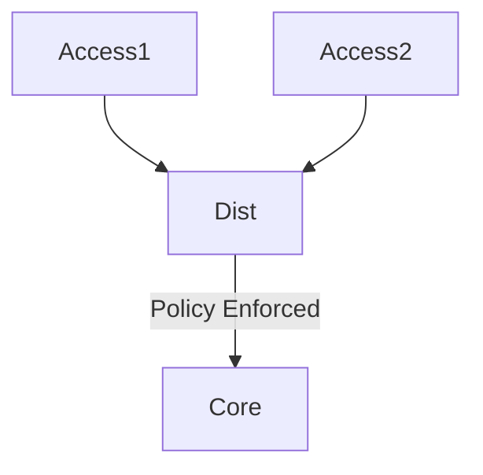
* Inter‑zone filtering
* Identity or context consumed
* Explicit allow/deny decisions

#### Patterns:
* `network-segmentation-and-zones`
* `network-mediation-and-policy-enforcement`

#### SSPP:
* **Secure Network Gateway SSPP**

The instant enforcement occurs, the distribution node becomes a gateway.

## Access Layer (Edge / Endpoint Entry)
Access Layer (Edge / Endpoint that point of attachment is **where trust must be evaluated**, not assumed.

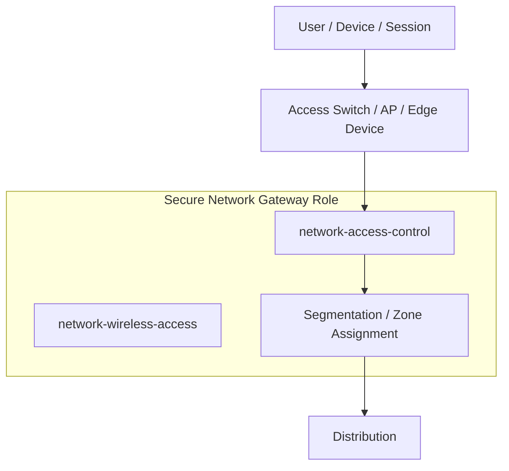
- Admitting users and devices
- Binding identity and context
- Assigning endpoints to trust zones
- Enforcing least‑privilege connectivity

### Secure Network Roles

**Patterns**
- `network-access-control`
- `network-wireless-access` *(for Wi‑Fi)*
- `network-remote-access` *(for brokered or VPN access)*
- `network-segmentation-and-zones`

**SSPPs**
- **Secure Network Gateway SSPP**
- **Secure Network Guest & Unmanaged Access SSPP** *(BYOD, guest, residence)*

> The access layer is almost always acting in a **Secure Network Gateway role**, because admission equals trust evaluation.

## Special Campus Scenarios
### Guest, BYOD, and Residence Networks

This includes:
* Campus guest Wi‑Fi
* Student residence networks
* Staff or faculty personal devices
* Other unmanaged endpoints

#### Patterns
* `network-wireless-access`
* `network-access-control`
* `network-egress-discipline`

#### SSPP
* **Secure Network Guest & Unmanaged Access SSPP**

#### Key Invariants
* Devices are assumed unmanaged
* User authentication is allowed
* Authentication ≠ trust
* Access limited to:
  * Internet egress
  * Public‑facing institutional services
* No lateral movement into internal networks

#### Mermaid Diagram — Guest / BYOD Access
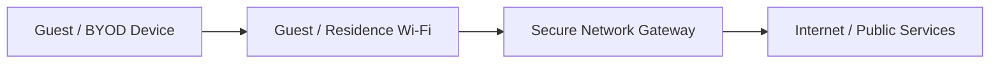
----
### eduroam
eduroam authentication is explicitly supported without extending trust.

#### Identity
Secure Identity Federation SSPP (external IdP)

#### Network
* `network-wireless-access`
* `network-access-control`

#### SSPP
* **Secure Network Guest & Unmanaged Access SSPP**

eduroam authenticates who the user is, not what the user may access.

#### Mermaid Diagram — eduroam Flow
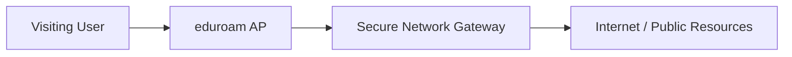

## Campus VPNs and Remote Sessions
VPNs and brokered remote access are treated as logical extensions, not trusted networks.

#### Patterns
* `network-logical-extension`
* `network-remote-access`
* `network-egress-discipline`

#### SSPPs
* **Secure Network Logical Extension SSPP**
* **Secure Network Gateway SSPP**
* **Secure Network Guest & Unmanaged Access SSPP** (for BYOD)

#### Invariant
* A VPN extends transport only, never trust.

#### Mermaid Diagram — VPN as Logical Extension
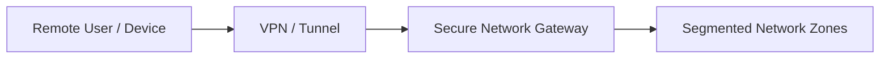
---
## Site‑to‑Site VPN (Campus ↔ Campus, Campus ↔ Cloud, Campus ↔ Partner)

Site‑to‑Site VPNs are a **logical network extension**, not a trust boundary.  
They are used to connect **networks to networks**, never to silently merge trust domains.

In the Secure Network model, a site‑to‑site VPN is **always subordinate to policy**, not a substitute for it.

---

### How Site‑to‑Site VPNs Are Treated

**What a site‑to‑site VPN does**
- Extends **transport reachability** between two networks
- Provides encryption and encapsulation
- Carries traffic between predefined endpoints

**What it must never do**
- Implicitly merge networks
- Collapse segmentation boundaries
- Bypass gateways or policy enforcement
- Replace identity‑aware access decisions

> **A site‑to‑site VPN connects roads — it does not merge countries.**

---

### Secure Network Patterns Involved

**Patterns**
- `network-logical-extension`
- `network-egress-discipline`
- `network-segmentation-and-zones`
- `network-mediation-and-policy-enforcement`
- `network-monitoring-and-response`

**SSPPs**
- **Secure Network Logical Extension SSPP**
- **Secure Network Gateway SSPP**
- **Secure Network Platform SSPP**
- *(Guest SSPP not applicable unless unmanaged endpoints appear behind the site)*

---

### Secure Invariants (Non‑Negotiable)

- Tunnel termination **must land inside a gateway**
- All traffic entering the tunnel:
  - is segmented
  - is policy‑evaluated
  - is monitored
- No “flat” routing across the tunnel
- Remote site is treated as **external by default**
- Explicit allow‑list of reachable services only

---

### Mermaid Diagram — Site‑to‑Site VPN Flow

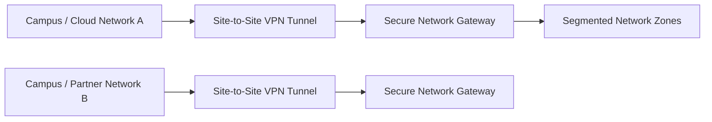
Key point:
* The VPN never bypasses the Secure Network Gateway.

### Common Approved Use Cases

| Use Case | Allowed | Notes |
| -------- | ------- | ----- |
| Campus ↔ Cloud VNet/VPC | ✅ | Gateway termination + segmentation required |
| Campus ↔ Campus | ✅ | Zones treated as distinct trust domains |
| Campus ↔ Partner| ✅ | Contract‑bound + least‑privilege |
| Flat L2 stretch across sites | ❌ | Violates segmentation and resiliency |
| Unfiltered RFC1918 routing | ❌ | Creates implicit trust |

#### Example: Campus ↔ Cloud
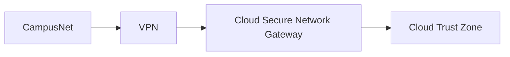
- VPN = transport
- Gateway = enforcement
- Zones = trust control

#### Example: Campus ↔ Partner
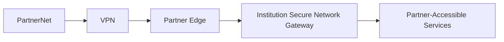
- Partner access is explicitly scoped
- Internal networks are not reachable
- Monitoring and revocation are mandatory

### How This Prevents Historic Failures
| Historic Failure | Prevented by |
| --------------- | ------------ |
| VPN flattens networks | Segmentation + Gateway termination |
| Partner lateral movement | Zone isolation |
| VPN bypasses NAC | Mandatory policy enforcement |
| “Trusted tunnel” myth | Logical Extension SSPP |

---
## Trust vs Topology (Key Distinction)
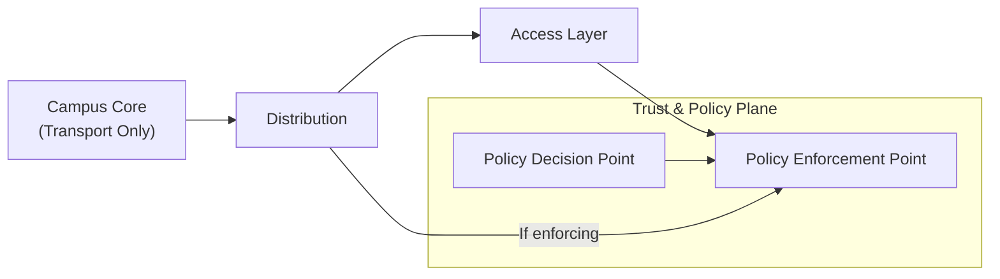
* Topology answers where traffic goes
* Secure Network roles and SSPPs answer where trust is decided and enforced

### One‑Sentence Rule (Recommended to Standardize)

Campus core, distribution, and access layers describe traffic flow.
Secure Network Gateways describe where trust policy is enforced.

## Summary
* Core = transport only
* Distribution = aggregation or enforcement (role‑dependent)
* Access = admission and trust evaluation
* Gateways are roles, not devices
* SSPPs prevent topology from becoming a security boundary
* Zero Trust is preserved end‑to‑end

This mapping ensures Secure Network remains consistent, auditable, and future‑proof across all campus environments.