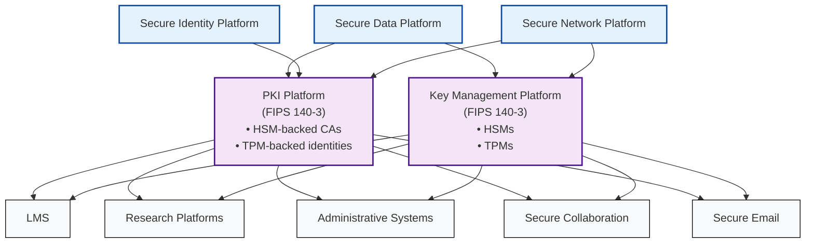
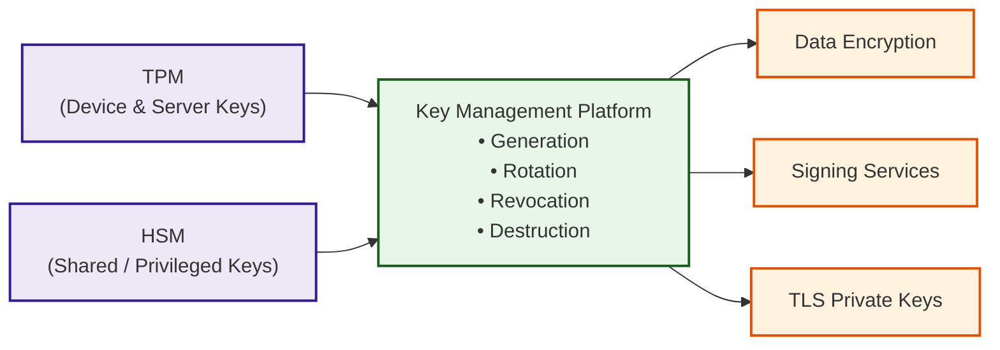
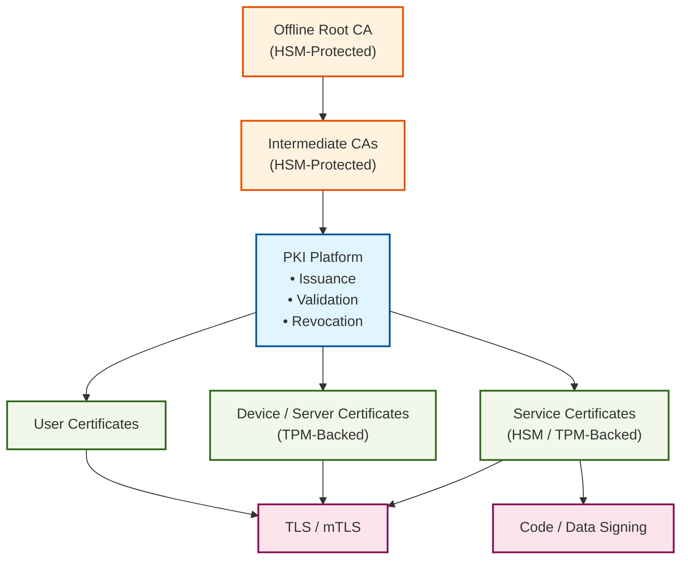

## PKI & Key Management — Institutional Dependency Model

---

## What this diagram enforces (architecturally)

- **Key Management and PKI are infrastructure, not features**
- **All crypto flows through KM and PKI**
- **Applications cannot own cryptographic trust**
- **Identity and Network anchor trust, but crypto is centralized**
- **FIPS 140‑3, HSMs, and TPMs sit at the foundation**

---

## Key Management Platform — Internal Trust Model

---

## What this diagram kills off

- ❌ Raw `.pem` / `.pfx` files
- ❌ App‑generated private keys
- ❌ Long‑lived, copied secrets
- ❌ Crypto hidden inside applications

---

## PKI Platform — Trust Establishment Model

---

## What this diagram enforces

- **No application‑local CAs**
- **No self‑signed production certificates**
- **Mandatory revocation checking**
- **TPM‑backed device and server identity**
- **HSM‑backed CA private keys**

---

## Executive One‑Line Summary (Use This Verbally)

> **All cryptographic trust flows through Key Management and PKI.  
> Applications consume trust — they never create it.**

---

## Where this fits in your architecture

These diagrams complete your **crypto trust story**, sitting cleanly alongside:

- Secure Data SSPPs
- Secure Network SSPPs
- Secure Identity SSPPs

They give auditors, engineers, and executives **the same mental model**, which is exactly how you eliminate crypto debt permanently.