# Secure Storage SSPP Template README

## Purpose

This README defines the **standard template and architectural context** for all **Secure Storage System Security & Privacy Plans (SSPPs)**.

Secure Storage SSPPs translate **storage security architecture** into **governed, enforceable obligations** while preserving strict separation between:

- authority
- platform implementation
- relying system behavior
- operations
- security operations
- governance and risk

They are designed to be **composable, auditable, explicit, and non‑overlapping**.

---

## What an SSPP Is (and Is Not)

### ✅ An SSPP **is**
- A **governance and enforcement contract**
- A **binding interpretation** of architecture patterns
- A **declarative expression of assumptions, invariants, and escalation**
- A mechanism for **preventing drift, ambiguity, and normalization of risk**

### ❌ An SSPP **is not**
- An architecture pattern
- A design document
- An implementation guide
- An incident response plan
- A risk acceptance log

---

## Secure Storage SSPP Families

Secure Storage SSPPs are divided into **five layers**, each with a distinct responsibility.

### 1. Authority SSPPs  
Define **who decides** and **what authority exists**.

- **Secure Storage Authority SSPP**

---

### 2. Base Storage SSPPs  
Define **what must be true** about secure storage behavior.

Each Base SSPP explicitly **binds to one or more Secure Storage patterns**.

- **Secure Storage Access Control SSPP**  
  ↔ Storage Access & Mediation Pattern

- **Secure Storage Cryptographic Protection SSPP**  
  ↔ Storage Core Security Pattern

- **Secure Storage Integrity & Immutability SSPP**  
  ↔ Storage Integrity & Immutability Pattern

- **Secure Storage Lifecycle & Retention SSPP**  
  ↔ Storage Lifecycle & Retention Pattern

- **Secure Storage Telemetry & Audit SSPP**  
  ↔ Storage Telemetry & Audit Pattern

- **Secure Storage Violation & Drift SSPP**  
  ↔ Cross‑cutting (Access, Core, Integrity, Lifecycle, Telemetry)

These SSPPs are **normative** and define enforceable expectations that persist over time.

---

### 3. Implementation SSPPs  
Define **how systems implement or consume** secure storage.

- **Secure Storage Platform SSPP**  
  Implements the **Secure Storage composite pattern**

- **Secure Storage Relying Systems SSPP**  
  Constrains how applications, services, pipelines, and automation consume secure storage without weakening guarantees

---

### 4. Operations SSPPs  
Define **how secure storage is sustained**, without redefining authority or policy.

- **Secure Storage Operations SSPP**

Operations SSPPs coordinate enforcement and escalation but **do not accept risk or perform incident response**.

---

### 5. Overlay SSPPs  
Define **environment‑ or assurance‑specific tightening**.

Overlays:
- do **not** redefine authority or base behavior
- express constraints via `system-characteristics`
- only tighten assumptions, never weaken them

#### Assurance Overlay
- **Secure Storage High‑Assurance SSPP**

#### Environment Overlays
- **Secure Storage IT Overlay SSPP**
- **Secure Storage OT Overlay SSPP**
- **Secure Storage IoMT Overlay SSPP**

---

## Canonical SSPP Structure

All Secure Storage SSPPs follow the same structural grammar:

- `metadata` – scope, purpose, and intent  
- `import-profile` – authoritative dependencies  
- `pattern-bindings` – explicit linkage to Secure Storage patterns  
- `system-characteristics` – assurance tier and environmental constraints  
- `system-implementation` – components, roles, rules, prohibitions, escalation  
- `control-implementation` – NIST 800‑53 alignment  
- `statements` – invariant rules  
- `back-matter` – inheritance and constraints  

All **explanatory content belongs in `remarks`**.  
No inline comments or annotations are permitted.

---

## Roles and Authority

### Key Principles

- **Authority is defined by domains and rules**, not by roles
- **NICE roles are responsibility anchors**, not decision engines
- **Rules may reference roles**, but roles never define authority

This prevents:
- administrator privilege creep
- automation normalization of risk
- platform self‑governance

---

## Secure Storage Architecture Overview

The following diagram shows **how Secure Storage patterns and SSPPs fit together**, from authority through enforcement to escalation.

```mermaid
flowchart TB

%% ==================================================
%% LAYER 1 — AUTHORITY
%% ==================================================
subgraph L1[Authority Layer]
  SSA[Secure Storage Authority SSPP]
end

%% ==================================================
%% LAYER 2 — STORAGE PATTERNS
%% ==================================================
subgraph L2[Storage Architecture Patterns]
  SC[Storage Core Security Pattern]
  SA[Storage Access & Mediation Pattern]
  SI[Storage Integrity & Immutability Pattern]
  SL[Storage Lifecycle & Retention Pattern]
  ST[Storage Telemetry & Audit Pattern]
end

SOC[Secure Storage Operations Composite Pattern]
%% LAYER 3 — BASE SSPPs
%% ==================================================
subgraph L3[Base Secure Storage SSPPs]
  SSAC[Access Control SSPP]
  SSCP[Cryptographic Protection SSPP]
  SSII[Integrity & Immutability SSPP]
  SSL[Lifecycle & Retention SSPP]
  SSTA[Telemetry & Audit SSPP]
  SSVD[Violation & Drift SSPP]
end

%% ==================================================
%% LAYER 4 — OVERLAYS
%% ==================================================
subgraph L4[Assurance & Environment Overlays]
  HA[High‑Assurance Storage SSPP]
  IT[IT Storage Overlay]
  OT[OT Storage Overlay]
  IOMT[IoMT Storage Overlay]
end

%% ==================================================
%% LAYER 5 — IMPLEMENTATION
%% ==================================================
subgraph L5[Implementation SSPPs]
  SSP[Storage Platform SSPP]
  SSR[Storage Relying Systems SSPP]
end

%% ==================================================
%% LAYER 6 — OPERATIONS
%% ==================================================
subgraph L6[Operations]
  SSO[Secure Storage Operations SSPP]
end

%% ==================================================
%% LAYER 7 — ESCALATION
%% ==================================================
subgraph L7[Escalation & Oversight]
  SEOPS[Security Operations]
  GOV[Governance & Risk]
end

%% ==================================================
%% FLOWS
%% ==================================================

%% Authority
SSA --> SSAC
SSA --> SSCP
SSA --> SSII
SSA --> SSL
SSA --> SSTA
SSA --> SSVD
SSA --> SSP
SSA --> SSR
SSA --> SSO

%% Pattern composition
SC --> SOC
SA --> SOC
SI --> SOC
SL --> SOC
ST --> SOC

%% Pattern → SSPP mapping
SA --> SSAC
SC --> SSCP
SI --> SSII
SL --> SSL
ST --> SSTA

%% Violation & Drift aggregation
SSAC --> SSVD
SSCP --> SSVD
SSII --> SSVD
SSL --> SSVD
SSTA --> SSVD

%% Overlays
SSAC --> HA
SSCP --> HA
SSII --> HA
SSL --> HA
SSTA --> HA
SSVD --> HA

HA --> IT
HA --> OT
HA --> IOMT

%% Implementation
SSAC --> SSP
SSCP --> SSP
SSII --> SSP
SSL --> SSP
SSTA --> SSP
SSVD --> SSP

SSAC --> SSR
SSCP --> SSR
SSII --> SSR
SSL --> SSR
SSTA --> SSR
SSVD --> SSR

%% Operations
SOC --> SSO
SSP --> SSO
SSR --> SSO
SSVD --> SSO

%% Escalation
SSVD --> SEOPS
SSVD --> GOV
SSO --> SEOPS
SSO --> GOV
```

## Architectural Invariants
All Secure Storage SSPPs enforce the following invariants:
* Storage authority is explicit and human‑owned
* Storage platforms cannot self‑exempt
* Relying systems cannot bypass
* Automation cannot accept risk
* Evidence must survive operational pressure
* Drift must escalate
* Governance retains decision authority

## Why Storage SSPPs Are Richer Than Server SSPPs
Secure Storage SSPPs differ from Secure Server SSPPs by design.
Storage:
* persists beyond compute lifecycles
* accumulates legal, regulatory, and evidentiary obligations
* becomes an authoritative system of record
* must preserve trust over time, not just execution
As a result:
* Storage SSPPs are capability‑centric and governance‑explicit
*Server SSPPs are signal‑centric and execution‑focused

This difference is intentional and necessary.

## Summary
Secure Storage SSPPs provide:
* explicit pattern traceability
* durable authority separation
* governed lifecycle enforcement
* clean escalation paths
* non‑overlapping responsibilities
* long‑term auditability

They ensure secure storage remains governed infrastructure, not an operational convenience.