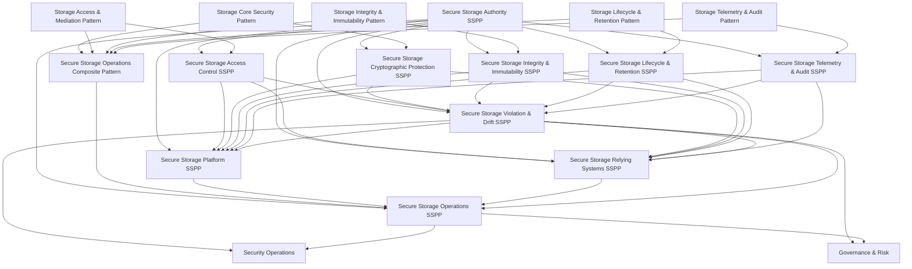

# Secure Storage SSPP Template README

## Purpose

This README defines the **standard template and architectural context** for all **Secure Storage System Security & Privacy Plans (SSPPs)**.

Secure Storage SSPPs translate **storage security architecture** into **governed, enforceable obligations** while preserving strict separation between:

- authority
- platform implementation
- relying system behavior
- operations
- security operations
- governance and risk

They are designed to be **composable, auditable, and non‑overlapping**.

---

## What an SSPP Is (and Is Not)

### ✅ An SSPP **is**
- A **governance and enforcement contract**
- A **binding interpretation** of architecture patterns
- A **boundary definition** for responsibility, authority, and escalation
- A mechanism for **preventing drift, ambiguity, and normalization of risk**

### ❌ An SSPP **is not**
- An architecture pattern
- A design document
- An implementation guide
- An incident response plan
- A risk acceptance log

---

## Secure Storage SSPP Families

Secure Storage SSPPs are divided into **four layers**, each with clear responsibility:

### 1. Authority SSPPs  
Define **who decides** and **what authority exists**.

- Secure Storage Authority SSPP

---

### 2. Base Storage SSPPs  
Define **what must be true** about secure storage behavior.

- Secure Storage Access Control SSPP  
- Secure Storage Cryptographic Protection SSPP  
- Secure Storage Integrity & Immutability SSPP  
- Secure Storage Lifecycle & Retention SSPP  
- Secure Storage Telemetry & Audit SSPP  
- Secure Storage Violation & Drift SSPP  

---

### 3. Implementation SSPPs  
Define **how systems must implement or consume** secure storage.

- Secure Storage Platform SSPP  
- Secure Storage Relying Systems SSPP  

---

### 4. Operations SSPPs  
Define **how secure storage is sustained**, without redefining authority.

- Secure Storage Operations SSPP  

---

## Canonical SSPP Structure

All Secure Storage SSPPs follow the same structural grammar:

- `metadata` – scope, purpose, and intent  
- `import-profile` – authoritative dependencies  
- `system-characteristics` – classification and sensitivity  
- `system-implementation` – components, roles, rules, prohibitions, escalation  
- `control-implementation` – NIST 800‑53 alignment  
- `statements` – invariant rules  
- `back-matter` – inheritance and constraints  

All **explanatory content belongs in `remarks`**.  
No inline comments or annotations are permitted.

---

## Roles and Authority

### Key Principles

- **Authority is defined by domains and rules**, not roles  
- **NICE roles are responsibility anchors**, not decision engines  
- **Rules may reference roles**, but roles never define authority  

This prevents:
- administrator privilege creep
- automation normalization of risk
- platform self‑governance

---

## Secure Storage Architecture Overview

The following diagram shows **how storage patterns and SSPPs fit together**, from authority through enforcement to escalation.

## Architectural Invariants

All Secure Storage SSPPs enforce the following invariants:

- Storage authority is **explicit and human‑owned**
- Storage platforms **cannot self‑exempt**
- Relying systems **cannot bypass**
- Automation **cannot accept risk**
- Evidence **must survive operational pressure**
- Drift **must escalate**
- Governance **retains decision authority**

---

## Extension and Overlays

After base SSPPs are defined, environment overlays may be applied:

- **IT Secure Storage Overlay SSPP**
- **OT Secure Storage Overlay SSPP**
- **IoMT Secure Storage Overlay SSPP**

Overlays **only tighten constraints**.  
They never weaken base SSPP guarantees.

---

## Summary

Secure Storage SSPPs provide:

- provable enforcement
- durable authority separation
- clean escalation paths
- non‑overlapping responsibilities
- long‑term auditability

They ensure secure storage remains **governed infrastructure**, not an operational convenience.
