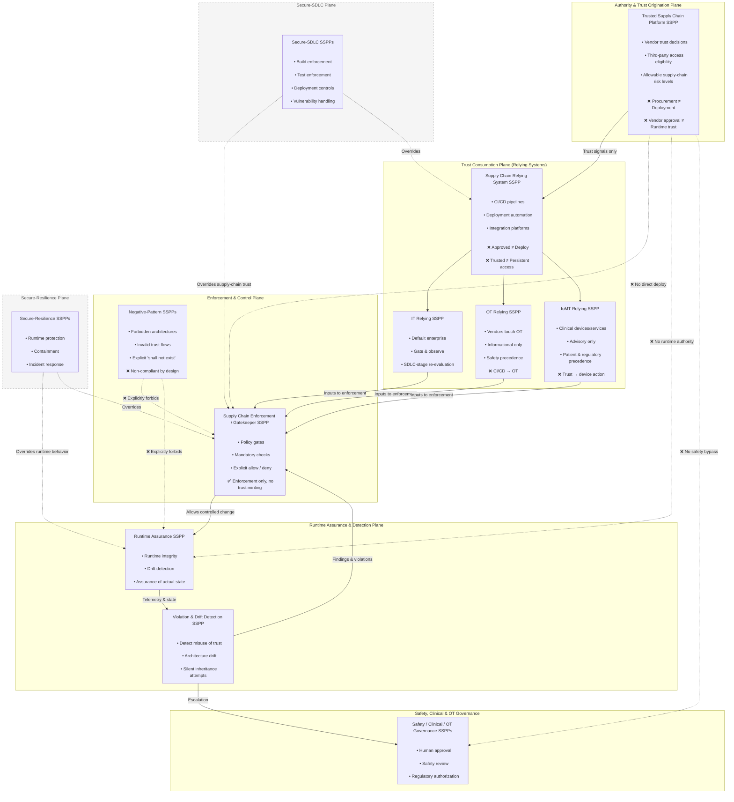

# Trusted Supply Chain Platform SSPP

## Purpose

The **Trusted Supply Chain Platform SSPP** defines the **authoritative trust‑origination plane** for supply‑chain security.  
Its sole purpose is to **mint, constrain, and revoke supply‑chain trust signals** — not to deploy software, grant runtime access, or authorize operations.

This SSPP establishes the constitutional rule:

> **Supply‑chain trust is advisory, contextual, and revocable — never executable.**

All downstream systems must **consume** trust signals under constraint and may not reinterpret them as authority.

This SSPP is intentionally scoped to supply‑chain trust origination only.  
`Secure‑SDLC SSPPs` and `Secure‑Resilience SSPPs` are explicitly **out of scope** for this template and retain independent authority over build, deployment, runtime protection, and incident response.

---

## What This SSPP Governs

The Trusted Supply Chain Platform SSPP is responsible for:

* Vendor trust and qualification decisions
* Third‑party access **eligibility** (not access itself)
* Allowable supply‑chain risk thresholds
* Supply‑chain policy assertions (e.g., provenance, dependency transparency)
* Explicit revocation of trust

It is the **only SSPP permitted to originate supply‑chain trust**.

---

## What This SSPP Explicitly Forbids

The following equivalences are **invalid by design**:

* ❌ Procurement approval **≠** deployment authorization  
* ❌ Vendor approval **≠** runtime trust  
* ❌ Signed artifact **≠** safe to deploy  
* ❌ Approved dependency **≠** deployable dependency  
* ❌ Historical trust **≠** persistent trust  

No compensating control, exception, or risk acceptance may override these prohibitions.

---

## Architectural Position

The Trusted Supply Chain Platform SSPP sits **above** all delivery, runtime, and safety systems and **below none**.

It cannot:
* deploy
* enforce
* execute
* grant access
* modify runtime state

It can only **assert or withdraw trust signals**.

---

## Relationship to Other SSPPs

### Downstream Supply‑Chain SSPPs

This SSPP feeds trust signals into, but does not authorize actions in:

* Supply Chain Relying System SSPPs (IT, OT, IoMT)
* Supply Chain Enforcement / Gatekeeper SSPPs
* Runtime Assurance SSPPs
* Violation & Drift Detection SSPPs

Each downstream SSPP must assume that trust:
* is context‑specific  
* expires  
* can be revoked  

---

### Relationship to Secure‑SDLC SSPPs

**Secure‑SDLC SSPPs always take precedence.**

Even when supply‑chain trust exists:
* Secure‑SDLC SSPPs determine whether code can be built, tested, and deployed
* Supply‑chain trust may **inform** SDLC decisions, but never override them
* A Secure‑SDLC deny **always wins**

This ensures:

> **Supply‑chain trust does not weaken SDLC rigor.**

---

### Relationship to Secure‑Resilience SSPPs

**Secure‑Resilience SSPPs dominate runtime behavior.**

Regardless of supplier trust:
* Runtime protection, containment, and recovery are governed exclusively by Secure‑Resilience SSPPs
* No supply‑chain trust signal may disable defenses, monitoring, or response
* Runtime safety is evaluated continuously, not inherited historically

This ensures:

> **Trust does not persist beyond reality.**

---

## Canonical Architecture

## Scope Boundary and External Authorities

The Trusted Supply Chain Platform SSPP does **not** define or control:

* build, test, or deployment enforcement
* runtime protection or containment
* vulnerability remediation workflows
* incident response actions

These functions are governed by **Secure‑SDLC SSPPs** and **Secure‑Resilience SSPPs**, which exist as **external, authoritative control planes**.  

They may consume supply‑chain trust signals as advisory input, but they are never subordinate to them.

## Design Principles
* Trust is not authority
* Authority must be explicit
* Runtime truth beats historical approval
* Safety and resilience override supply‑chain trust
* Forbidden architectures are invalid by existence

## Compliance Scope
This SSPP supports compliance with:
* NIST SP 800‑53 Rev. 5 (SA, SR, PL, RA)
* NIST Secure Software Development Framework (SSDF)
* Supply‑chain risk management requirements (enterprise, OT, and IoMT contexts)

Controls are not satisfied solely through supplier trust or artifacts.

## Summary
The Trusted Supply Chain Platform SSPP establishes who may be considered trustworthy, nothing more.

It deliberately does not:
* deploy software
* open access
* weaken runtime defenses
* substitute for SDLC or resilience controls

Every SSPP downstream exists to ensure that this trust:
* never escapes its lane.